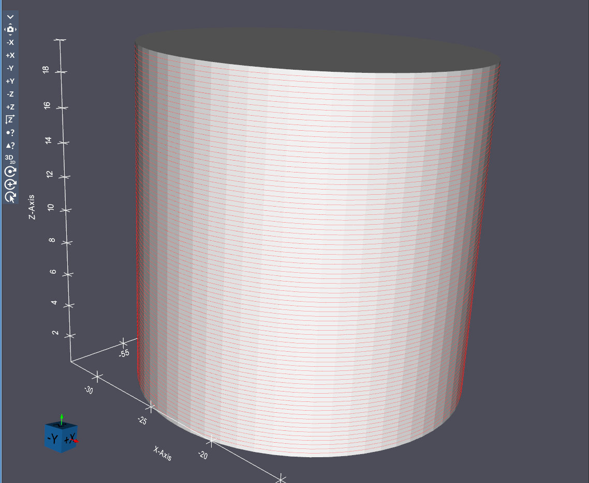
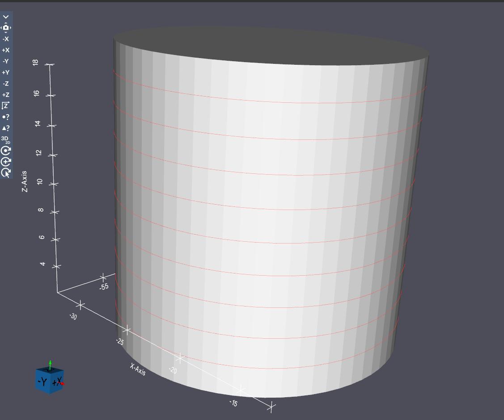

# Slice Triangle Geometry

## Group (Subgroup)

Sampling (Geometry)

## Description

This **Filter** slices an input **Triangle Geometry**, producing an **Edge Geometry**.  The user can control the range over which to slice (either the entire range of the geometry or a specified subregion), and the spacing between slices. Currently this filter only supports slicing along the direction of the z axis. The total area and perimeter of each slice is also computed and stored as an attribute on each created slice.

Both the *Slice Spacing* and the *User Defined Range* values are specified in the same physical units as the input **Triangle Geometry** coordinates (for example, microns if the mesh is in microns). The computed slice area and perimeter are likewise reported in those physical units (squared, for area).

Additionally, if the input **Triangle Geometry** is labeled with an identifier array (such as different regions or features), the user may select this array and the resulting edges will inherit these identifiers.

## Example Output

Example Surface Mesh being sliced with a 0.25 slice spacing.

Example Surface Mesh being sliced with a 2.0 slice spacing.

### Slice Range

The *Slice Range* parameter controls which portion of the geometry is sliced:

- **Full Range [0]**: Slices across the entire extent of the geometry along the slicing direction.
- **User Defined Range [1]**: Allows specifying custom start and end values (in the geometry's physical units) for the slicing range, restricting slices to a subregion of the geometry.

### Required Input Sources

- **Triangle Geometry** -- an existing surface mesh. Typically produced by [Create Surface Mesh (QuickMesh)](QuickSurfaceMeshFilter.md), read from disk via [Read STL File](ReadStlFileFilter.md), or assembled from multiple files by [Combine STL Files](CombineStlFilesFilter.md).

% Auto generated parameter table will be inserted here

## Example Pipelines

CreateScanVectors

## License & Copyright 

Please see the description file distributed with this plugin.

## DREAM3D-NX Help

If you need help, need to file a bug report or want to request a new feature, please head over to the [DREAM3DNX-Issues](https://github.com/BlueQuartzSoftware/DREAM3DNX-Issues/discussions) GitHub site where the community of DREAM3D-NX users can help answer your questions.