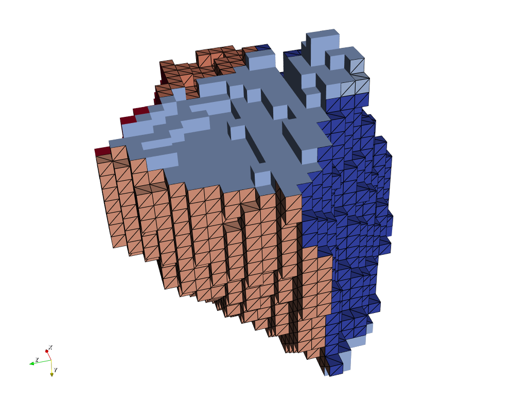
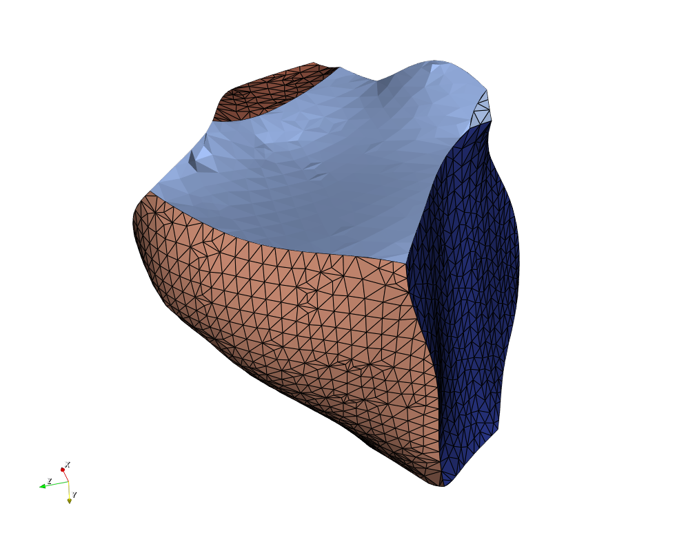

# Create Surface Mesh (Surface Nets)

## Group (Subgroup)

Surface Meshing (Generation)

## Description

This filter generates a **Triangle Geometry** (a surface mesh) that wraps the boundaries between labeled regions in a volume. It uses the **Surface Nets** algorithm from {1}. The code is based directly on the sample code from that paper, modified to work with the simplnx library classes.

Unlike **marching cubes** (a classic algorithm that builds an isosurface by placing triangles inside each cube of eight neighboring **Cells**), Surface Nets keeps sharp edges between materials while still producing a mesh that is generally smoother and higher quality than either marching cubes or the older [Create Surface Mesh (QuickMesh)](QuickSurfaceMeshFilter.md) approach.

An **isosurface** is the surface that separates regions above a threshold from regions below it; for a labeled volume the "threshold" is simply the boundary between one **Feature** label and a different one.

From the abstract of the paper:

> We extend 3D SurfaceNets to generate surfaces of segmented 3D medical images composed
> of multiple materials represented as indexed labels. Our extension generates smooth, high-
> quality triangle meshes suitable for rendering and tetrahedralization, preserves topology and
> sharp boundaries between materials, guarantees a user-specified accuracy, and is fast enough
> that users can interactively explore the trade-off between accuracy and surface smoothness.

The filter writes a **Face Labels** array on each triangle: a 2-component value holding the **Feature** Id on either side of the triangle. The filter guarantees the smaller of the two Face Labels values is always stored in the first component (component 0), so that assumptions made in downstream filters continue to work correctly.

The filter also attempts to repair the triangle **winding** (the order in which a triangle's three vertices are listed, which determines the direction its normal points). A fully consistent winding may not be achievable because of how meshes are stored in the software; see [Verify Triangle Winding](VerifyTriangleWindingFilter.md) for a detailed breakdown of the nuances.

The *Relaxation Iterations* parameter is a dimensionless count of smoothing passes, and *Max Distance from Voxel Center* is a physical length (same units as the Image Geometry spacing) limiting how far a node may move from its originating voxel center.

---------------

SurfaceNets without the built-in smoothing applied

---------------

SurfaceNets output **with** the built-in smoothing operation applied.

---------------

## Node Types

During the meshing process, each vertex, or node, will get a "Node Type" value assigned to it. This filter uses the same convention as the Create Surface Mesh (QuickMesh) and Create Surface Mesh (M3C) **Filters**: the value is the number of distinct **Features** meeting at the node, capped at 4, plus 10 when the node lies on the outer surface of the bounding box.

| Id Value | Node Type |
|----------|-----------|
| 2 | Normal **Vertex** |
| 3 | Triple Line |
| 4 | Quadruple Point (four or more Features meet) |
| 12 | Normal **Vertex** on the outer surface of the bounding box |
| 13 | Triple Line on the outer surface of the bounding box |
| 14 | Quadruple Point on the outer surface of the bounding box |

### Exterior or Boundary Nodes

Nodes that appear on the outer surface of the bounding box have Node Type values starting at 12 and going up from there. For instance, a triple line that is also on the exterior of the volume has a value of 13.

### Exterior or Boundary Triangles

Each triangle has a 2-component **Face Labels** array that holds the Feature Id on either side of the triangle. If a triangle lies on the border of the virtual bounding box, one of its Face Labels values is -1.

## Notes

This filter should be used in place of the [Create Surface Mesh (QuickMesh)](QuickSurfaceMeshFilter.md) filter.

### Required Input Sources

- **Image Geometry** -- the labeled volume to mesh, from an image/volume reader or an upstream processing filter.
- **Cell Feature Ids** -- the per-Cell integer label array that defines the regions to wrap, typically produced by a segmentation filter such as [Segment Features (Scalar)](ScalarSegmentFeaturesFilter.md).

## Comparison of Surface Meshing Filters

DREAM3D-NX provides three **Filters** that convert a segmented grid into a multi-material triangle surface mesh. All three produce the same output data model (a **Triangle Geometry** with **Face Labels** and **Node Types**), so they are interchangeable inputs to downstream mesh **Filters**; they differ in how the triangles are generated and therefore in mesh smoothness, triangle count, and performance.

| Aspect | Create Surface Mesh (QuickMesh) | Create Surface Mesh (Surface Nets) | Create Surface Mesh (M3C) |
|---|---|---|---|
| Algorithm | Voxel-face ("staircase") | Dual (SurfaceNets) | Primal multi-material marching cubes |
| Vertex placement | Voxel corners | One relaxed vertex per boundary **Cell** | On **Cell** edges/faces |
| Surface quality | Blocky / stair-stepped | Smooth, sharp edges preserved | Faceted (marching-cubes) |
| Built-in smoothing | No (apply Laplacian Smoothing afterward) | Yes, optional and accuracy-controlled | No (apply Laplacian Smoothing afterward) |
| Relative triangle count | Highest | Lowest | Moderate to high (configuration dependent) |
| Multi-material junctions | Yes | Native | Yes (via case table) |
| Performance | Fastest | Fast (parallelized) | Moderate (multithreaded) |
| Status | Deprecated | Recommended default | Specialized / legacy-compatible |

**Guidance:** Surface Nets is the recommended default for most workflows — it yields the smoothest mesh with the fewest triangles and preserves sharp boundaries. Use M3C when a primal, marching-cubes case-table topology is required for a specific downstream modeling or simulation workflow. QuickMesh is retained for backward compatibility.

### Omitting the Bounding Box Skin

By default this filter generates triangles covering all six outer walls of the Image
Geometry's bounding box. These faces are artifacts of where the volume was cropped rather
than real interfaces, and they receive a Face Label of `-1` on the exterior side.

Enabling **Omit Bounding Box Skin** suppresses a wall face when the voxel behind it is
background (Feature Id 0) — that is, when its Face Labels would be `{-1, 0}`. Wall faces
that cap a *real* Feature are still generated, because that cut plane is the only possible
closure for a Feature flush with the box. A cylinder sitting flush with the box floor
therefore comes out as a closed surface with no surrounding box.

On a fully-indexed volume with no Feature Id 0 voxels, nothing is dropped and the option
has no effect — every boundary Feature already needs its wall cap to stay closed.

Because the test is per-face rather than per-vertex, no triangles are lost along the rim
where an internal boundary meets the box wall.

% Auto generated parameter table will be inserted here

## Example Pipelines

Pipelines/SimplnxCore/SurfaceNets_Demo.d3dpipeline

## Citations

{1} [SurfaceNets for Multi-Label Segmentations with Preservation of Sharp Boundaries](https://jcgt.org/published/0011/01/03/paper.pdf)

Sarah F. Frisken, *SurfaceNets for Multi-Label Segmentations with Preservation of Sharp Boundaries*, Journal of Computer Graphics Techniques (JCGT), vol. 11, no. 1, 34-54, 2022. [http://jcgt.org/published/0011/01/03](http://jcgt.org/published/0011/01/03)

## License & Copyright

Please see the description file distributed with this **Plugin**

## DREAM3D-NX Help

If you need help, need to file a bug report or want to request a new feature, please head over to the [DREAM3DNX-Issues](https://github.com/BlueQuartzSoftware/DREAM3DNX-Issues/discussions) GitHub site where the community of DREAM3D-NX users can help answer your questions.
