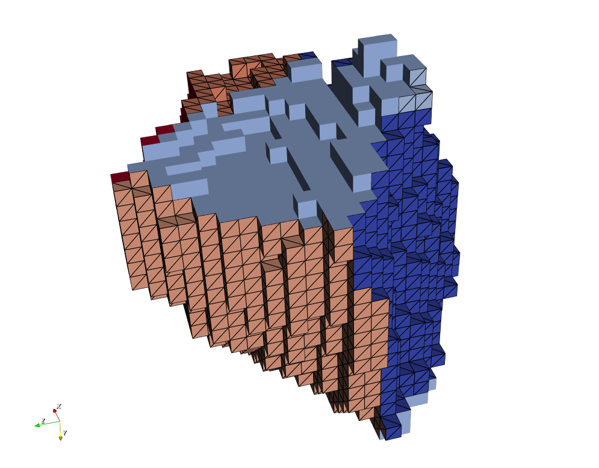
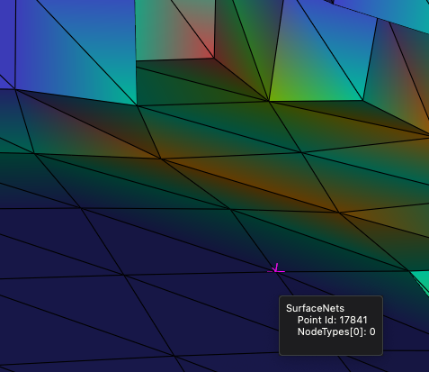
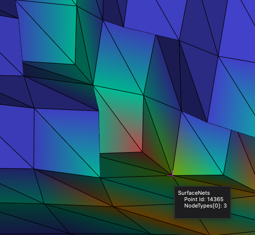
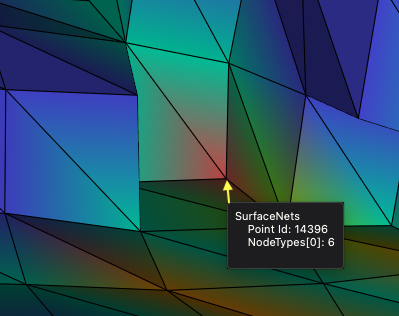
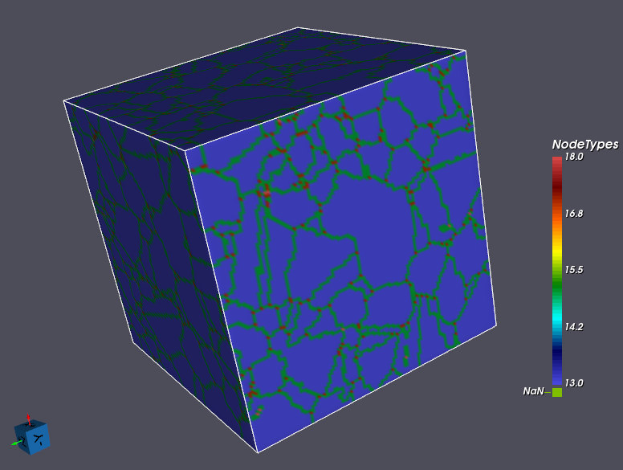

# SurfaceNets Meshing Filter

## Group (Subgroup)

Surface Meshing (Generation)

## Description

This filter uses the algorithm from {1} to produce a triangle surface mesh. The code is directly based on the sample code from the paper but has been modified to
work with the simplnx library classes. This filter uses a different algorithm that aims to produce a mush that keeps sharp edges
while still producing a mesh superior to marching cubes or QuickMesh.

From the abstract of the paper:

        We extend 3D SurfaceNets to generate surfaces of segmented 3D medical images composed
        of multiple materials represented as indexed labels. Our extension generates smooth, high-
        quality triangle meshes suitable for rendering and tetrahedralization, preserves topology and
        sharp boundaries between materials, guarantees a user-specified accuracy, and is fast enough
        that users can interactively explore the trade-off between accuracy and surface smoothness.

This filter will ensure that the smallest of the 2 **FaceLabel** values will always be in the first component (component[0]). This will allow assumptions made in
downstream filters to continue to work correctly.

---------------

SurfaceNets without the built-in smoothing applied

---------------

SurfaceNets output **with** the built-in smoothing operation applied.

---------------

## Node Types

During the meshing process, each vertex, or node, will get a "Node Type" value assigned to it. These will range from 0 to 6. The value is an internal representation from the SurfaceNets algorithm. They are roughly equivelent to the Node Types from the Quick Surface Mesh algorithm but not strictly the same.

- Node Type = 0: This is a node that ONLY has 2 features connected to the node.
- Node Type = 2: This is a node that has 3 features connected to the node, such as a triple line
- Node Type = 3-6: These nodes have 4 or more features connected to the node.

| Node Type | Example Image                                |
|-----------|----------------------------------------------|
| 0 | |
| 2 |  |
| 3 |  |
| 4 | |
| 6 |  |

### Exterior or Boundary Nodes

Nodes that appear on the exterior of a volume have Node Type values starting at 10 and going up from there. For instance, a triple line that is also on the exterior of the volume should have a value of 12.

% Auto generated parameter table will be inserted here

## Example Pipelines

        Pipelines/SimplnxCore/SurfaceNets_Demo.d3dpipeline

## Citations

{1}[SurfaceNets for Multi-Label Segmentations with Preservation of Sharp Boundaries](https://jcgt.org/published/0011/01/03/paper.pdf)

## License & Copyright

`Sarah F. Frisken, SurfaceNets for Multi-Label Segmentations with Preservation of Sharp
Boundaries, Journal of Computer Graphics Techniques (JCGT), vol. 11, no. 1, 34–54, 2022`
[http://jcgt.org/published/0011/01/03](http://jcgt.org/published/0011/01/03)

## DREAM.3D Mailing Lists

If you need more help with a **Filter**, please consider asking your question on
the [DREAM.3D Users Google group!](https://groups.google.com/forum/?hl=en#!forum/dream3d-users)
