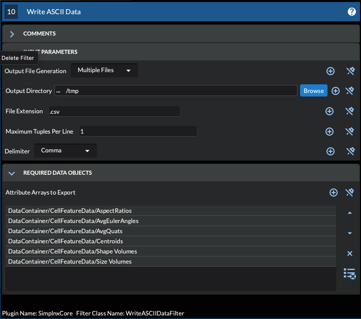
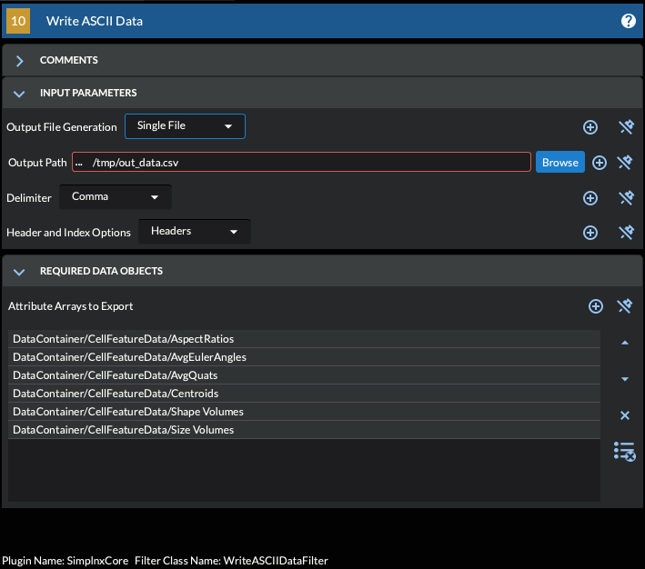

# Write ASCII Data

## Group (Subgroup)

IO (Output) (Write) (Export) (Text) (CSV) (ASCII)

## Description

This filter will write the selected DataArrays to either individual files or as a single CSV style of file.

## String Data Array Caveats

- The "Maximum Tuples per Line" will not have any effect for that specific array.
- If the output is for a single file, then each String value will be enclosed in a set of Single Quotes (') characters.

### Multiple Files

Each input data array will be written to its own output file. The name of the file will be the name of the Data Array + the extension from the parameters.



### Single File

The output data file will be a column oriented CSV file. The optional header of each column will be the name of the Data Array. If the Data Array has multiple components then the zero based index will also be appended to the data array name. For example Euler Angles have 3 components, the header would look like:

```console
Euler_0,Euler_1,Euler_2
```



% Auto generated parameter table will be inserted here

## License & Copyright

Please see the description file distributed with this **Plugin**

## DREAM3D-NX Help

If you need help, need to file a bug report or want to request a new feature, please head over to the [DREAM3DNX-Issues](https://github.com/BlueQuartzSoftware/DREAM3DNX-Issues/discussions) GItHub site where the community of DREAM3D-NX users can help answer your questions.
