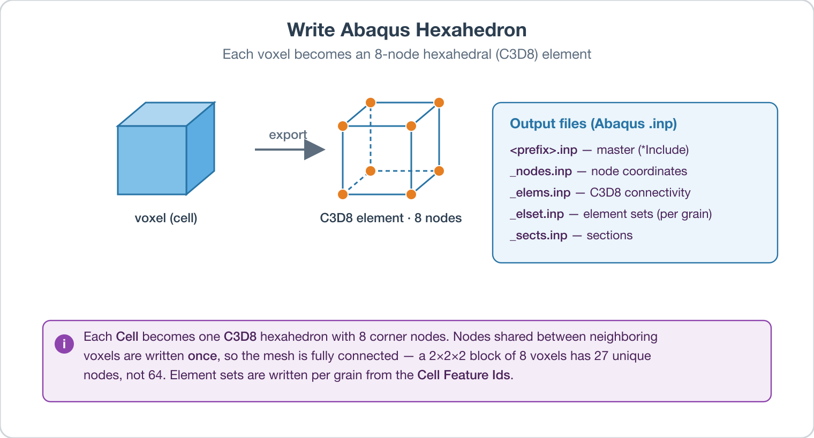

# Write Abaqus Hexahedron

## Group (Subgroup)

IO (Output)

## Description

This filter converts a voxel grid (an **Image Geometry**) into a hexahedral element mesh and writes it to a set of Abaqus input (`.inp`) files. **Abaqus** is a commercial *finite-element-analysis* (FEA) software package; FEA is a numerical technique that divides a body into many small, simple elements and solves for quantities such as stress and strain across them. By exporting the microstructure as an Abaqus mesh, the filter lets users run mechanical (stress/strain) simulations on a digital microstructure.

Each **Cell** (voxel) in the **Image Geometry** becomes one hexahedral (brick-shaped) element with 8 corner nodes. Nodes shared between neighboring voxels are written only once so the mesh is fully connected. The element type written is `C3D8`, Abaqus's standard 8-node linear brick element. Every element is assigned to an element set named after the **Feature** (grain) it belongs to, using the *Cell Feature Ids* array, so each grain can be given its own material in the simulation.



### Output Files

The filter writes five plain-text files. The first is a master file that pulls in the other four using Abaqus's `*Include` directive, so the simulation is launched from the master file alone:

- `<prefix>.inp` — the master file. It `*Include`s the four files below.
- `<prefix>_nodes.inp` — the node coordinates.
- `<prefix>_elems.inp` — the element connectivity (which 8 nodes make up each element).
- `<prefix>_elset.inp` — the element sets (one set per grain).
- `<prefix>_sects.inp` — the section definitions assigning a material to each grain set.

Node coordinates are written in the physical units of the **Image Geometry** (for example microns, if the geometry's spacing is in microns). Each node coordinate is the voxel-grid position scaled by the geometry spacing and offset by its origin.

### Write Dummy Node

When the *Write Dummy Node* parameter is enabled, the filter appends one extra "dummy" node at the end of the `_nodes.inp` file. This node is not attached to any element; it exists only as a reference point that some Abaqus stress/strain workflows require (for example, to apply or read periodic boundary conditions). If the export is not being used for stress/strain curves, this parameter should be disabled, because the unused node can interfere with mesh connectivity tools that expect every node to belong to an element.

### Hourglass Stiffness

The `_sects.inp` file includes an `*Hourglass Stiffness` value for each grain section. "Hourglass" modes are spurious, zero-energy deformation patterns that reduced-integration brick elements can exhibit; a small artificial stiffness suppresses them. The *Hourglass Stiffness Value* parameter sets this number (default *250*, a dimensionless solver-control value).

### Required Input Sources

- **Image Geometry** -- the voxel grid to export.
- **Cell Feature Ids** -- produced by a segmentation filter such as [Segment Features (Scalar)](ScalarSegmentFeaturesFilter.md). One element set is written per Feature Id.

### Example Output

The headers in the snippets below read `DREAM3DLib Version 5.1.566`; these version strings are illustrative and will reflect the actual version that wrote the file. The filter is based on a Python script developed by Matthew W. Priddy (Georgia Tech, early 2015).

The master file:

```text
*Heading
Job 101
** Job name : Job 101
** Generated by : DREAM3DLib Version 5.1.566
*Preprint, echo = NO, model = NO, history = NO, contact = NO
**
** ----------------------------Geometry----------------------------
**
*Include, Input = 32x32x32_nodes.inp
*Include, Input = 32x32x32_elems.inp
*Include, Input = 32x32x32_elset.inp
*Include, Input = 32x32x32_sects.inp
```

The `_nodes.inp` file (node ID followed by x, y, z in geometry units):

```text
*Node
1, 0.000000, 0.000000, 0.000000
2, 0.500000, 0.000000, 0.000000
3, 1.000000, 0.000000, 0.000000
   ..
```

The `_elems.inp` file (element ID followed by its 8 node IDs):

```text
*Element, type=C3D8
1, 1091, 2, 1, 1090, 1124, 35, 34, 1123
2, 1092, 3, 2, 1091, 1125, 36, 35, 1124
   ..
```

The `_elset.inp` file (a "cube" set spanning all elements, then one set per grain — the full grain sets contain many element IDs and are abbreviated here):

```text
** The element sets
*Elset, elset=cube, generate
1, 32768, 1
**
*Elset, elset=Grain1_set
24126, 24127, 24128, 24159, 24160, 24191, 24192, 25085, 25086, ..
*Elset, elset=Grain2_set
   ..
```

The `_sects.inp` file (one section per grain, each with its hourglass stiffness):

```text
** Section: Grain1
*Solid Section, elset=Grain1_set, material=Grain_Mat1
*Hourglass Stiffness
250
** Section: Grain2
*Solid Section, elset=Grain2_set, material=Grain_Mat2
   ..
```

% Auto generated parameter table will be inserted here

## License & Copyright

Please see the description file distributed with this **Plugin**

## DREAM3D-NX Help

If you need help, need to file a bug report or want to request a new feature, please head over to the [DREAM3DNX-Issues](https://github.com/BlueQuartzSoftware/DREAM3DNX-Issues/discussions) GitHub site where the community of DREAM3D-NX users can help answer your questions.
