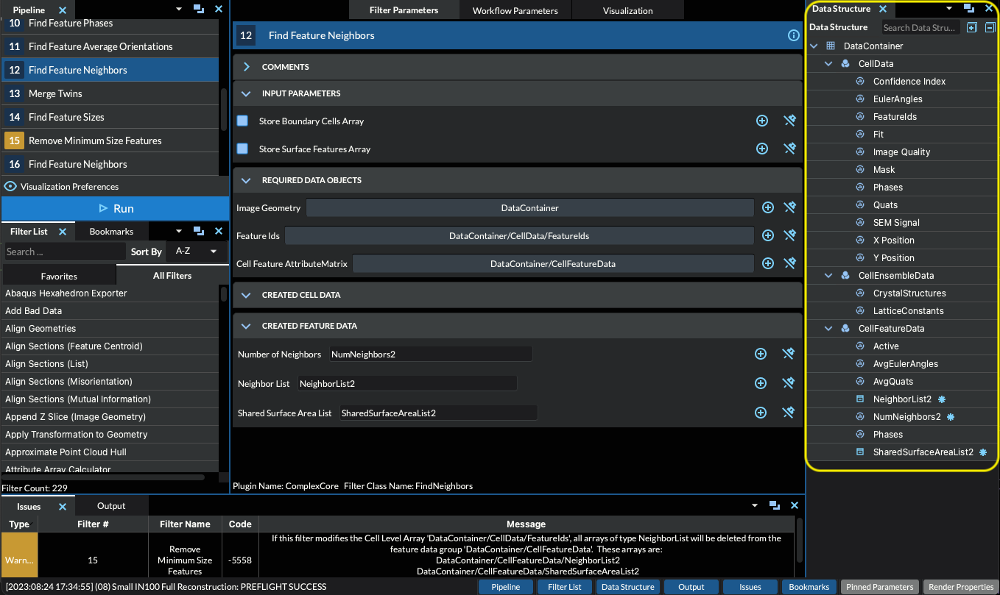
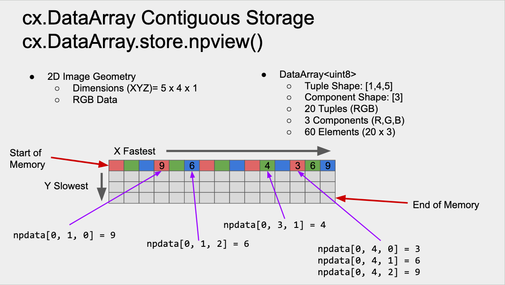
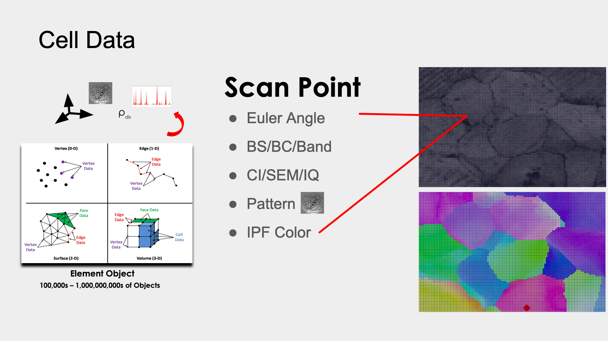

DataStructure Objects
======================

.. _DataStructure:

DataStructure
----------------

The **simplnx** DataStructure can be filled with various types of objects. Those are
all listed below. In the **DREAM3D-NX** user interface, the DataStructure of any
pipeline can be inspected via the "DataStructure" view, shown below outlined in 
a yellow box at the right side of the user interface.

- All DataObjects are stored in a DataStructure. 
- Multiple DataStructure objects are allowed in a python program.

.. py:class:: DataStructure

   .. py:method:: [data_path]
                  [string]

      Retrieves the DataObject at the given DataPath_

      :param DataPath data_path: The DataPath (or string convertable to a DataPath) to retrieve.

   .. py:method:: size()

      :return: An integer that is the total number of all objects that are held by the DataStructure.
      :rtype: int

   .. py:method:: remove(data_path)
                  remove(string)

      :param DataPath data_path: The DataPath (or string convertable to a DataPath) to remove from the DataStructure.
      :return: A boolean indicating if the path was removed or not.
      :rtype: Bool

   .. py:method:: hierarchy_to_str()

      :return: A string that attempts to show the internal hierarchy of the DataStructure
      :rtype: string

   .. py:method:: hierarchy_to_graphviz()

      :return: A string that attempts to show the internal hierarchy of the DataStructure formatted in the GraphViz 'dot' language.
      :rtype: string

   .. py:method:: get_children(simplnx.DataPath)
                  get_children(string)

      :param DataPath data_path: The DataPath (or string convertable to a DataPath) to get the children. An empty DataPath object will return the top level DataPaths.
      :return: A string that attempts to show the internal hierarchy of the DataStructure
      :rtype: List of DataPath_
      
.. code:: python

   # this is just sample code. The developer is expected to use these on well
   # constructed DataStructure objects.
   data_structure = cx.DataStructure()
   num_objects = data_structure.size
   did_remove = data_structure.remove(simplnx.DataPath("/Path/to/Object"))
   hierarchy = data_structure.hierarchy_to_str()
   hierarchy_gv = data_structure.hierarchy_to_graphviz()
   top_level_child_paths = data_structure.get_children()
   child_paths = data_structure.get_children(simplnx.DataPath("Group"))
   child_paths = data_structure.get_children("/Path/to/Object")

.. _DataObject:

DataObject
----------

This is the abstract base class for all other objects that can be inserted into the
DataStructure_ . It should never be used as the appropriate class from the list
below should be used instead.

.. py:class:: DataObject

   :ivar id: Integer. The internal id value used in the DataStructure
   :ivar name: String. The name of the object
   :var type: simplnx.DataObject.DataObjectType value

The possible *type* values are:

- simplnx.DataObject::Type::DataObject
- simplnx.DataObject::Type::DynamicListArray
- simplnx.DataObject::Type::ScalarData
- simplnx.DataObject::Type::BaseGroup
- simplnx.DataObject::Type::AttributeMatrix
- simplnx.DataObject::Type::DataGroup
- simplnx.DataObject::Type::IDataArray
- simplnx.DataObject::Type::DataArray
- simplnx.DataObject::Type::IGeometry
- simplnx.DataObject::Type::IGridGeometry
- simplnx.DataObject::Type::RectGridGeom
- simplnx.DataObject::Type::ImageGeom
- simplnx.DataObject::Type::INodeGeometry0D
- simplnx.DataObject::Type::VertexGeom
- simplnx.DataObject::Type::INodeGeometry1D
- simplnx.DataObject::Type::EdgeGeom
- simplnx.DataObject::Type::INodeGeometry2D
- simplnx.DataObject::Type::QuadGeom
- simplnx.DataObject::Type::TriangleGeom
- simplnx.DataObject::Type::INodeGeometry3D
- simplnx.DataObject::Type::HexahedralGeom
- simplnx.DataObject::Type::TetrahedralGeom
- simplnx.DataObject::Type::INeighborList
- simplnx.DataObject::Type::NeighborList
- simplnx.DataObject::Type::StringArray
- simplnx.DataObject::Type::AbstractMontage
- simplnx.DataObject::Type::GridMontage
- simplnx.DataObject::Type::Unknown
- simplnx.DataObject::Type::Any

   .. code:: python

      data_object = data_structure["Image Geometry"]
      if data_object.type == cx.DataObject.DataObjectType.ImageGeom:
         print("Image Geometry")
      else:
         print("NOT Image Geometry")
   
.. _DataPath:

DataPath
---------

A DataPath is a simplnx class that describes the path to a :ref:`DataObject` within 
the DataStructure_ . The path is constructed as a python list of string objects.
For example if we have a top level group called **MyGroup** and a `DataArray<DataArray>` 
called *Euler Angles* within that group the **DataPath** object that would be constructed is the following

.. code:: python

  array_path = cx.DataPath(['MyGroup', 'Euler Angles'])
  array_path = cx.DataPath("MyGroup/Euler Angles")

.. _DataGroup:

DataGroup
---------

The DataStructure_ is a flexible heirarchy that stores all **simplnx** :ref:`DataObjects <DataObject>`
that are created. A basic :ref:`DataObject` that can be created is a :ref:`DataGroup` which is a 
simple grouping mechanism that can be thought of as similar in concept to a folder or directory that 
is created on the file system. The programmer can use the :ref:`CreateDataGroup<CreateDataGroup>` filter to create
any needed DataGroups.

.. code:: python

   result = cx.CreateDataGroup.execute(data_structure=data_structure,
                                    Data_Object_Path=cx.DataPath(['Group']))

.. _DataArray:

DataArray
-----------

The DataArray is the main class that holds the raw data. It is typically a contiguous
chunk of memory that is allocated to hold the data that will be processed. The DataArray
has a few properties that should be well understood by the user before starting to develop
codes that are based on the `simplnx <https://www.github.com/bluequartzsoftware/complex>`_ library.

+ name: Each **DataArray** has a name that is assigned to it. Most any character can be used except for the '/' character.
+ tuple_shape: The DataArray will have a tuple shape that is describe by an array values that are listed in "C" order of slowest to fastest moving dimension.
+ component_shape: At **each** tuple, there can be multiple values which are described by the *component shape* which is an array of values that are listed in teh "C" order of slowest to fastest moving dimension.

Referring to the figure above, The **DataArray** that has been created is a 2D DataArray with 
dimensions of 4 high and 5 tuples wide. Each tuple has 3 components, the RGB values of a color image. Refer to the 
memory schemtic in the above image to understand how this would be layed out in memory and subsequently
accessed with the *numpy* API. The following is the python code that would craete the *DataArray* used
in the example.

.. py:class:: DataArray

   :ivar name: The name of the DataArray
   :ivar tuple_shape: The dimensions of the DataArray from slowest to fastest (C Ordering)
   :ivar component_shape: The dimensions of the components of the DataArray from slowest to fastest (C Ordering)
   :ivar store: The DataStore object.
   :ivar dtype: The type of data stored in the DataArray

This code will create a DataArray called "2D Array" with tuple dimensions of [4,5], 
3 components at each tuple, of type Float32 with every element initialized to "0.0"
and then print the name, tuple_dimensions and component_dims of the created DatArray object

  .. code:: python

   data_structure = cx.DataStructure()
   result = cx.CreateDataArray.execute(data_structure=data_structure, 
                                        component_count=3, 
                                        data_format="", 
                                        initialization_value="0", 
                                        numeric_type=cx.NumericType.float32, 
                                        output_data_array=cx.DataPath(["2D Array"]), 
                                        tuple_dimensions=[[4, 5]])
                                        
   data_array = data_structure[output_array_path]
   print(f'name: {data_array.name}')
   print(f'tuple_shape: {data_array.tuple_shape}')
   print(f'component_shape: {data_array.component_shape}')
   print(f'dtype: {data_array.dtype}')

The output produced is:

::

   name: 2D Array
   tuple_shape: [4, 5]
   component_shape: [3]
   dtype: float32

.. _DataStore:

DataStore
----------

The DataStore is the C++ object that actually allocates the memory necessary to store
data in simplnx/DREAM3D. The Python API is intentially limited to getting a Numpy.View()
so that python developers can have a consistent well known interace to the DataArray_. The
programmer will never need to create from scratch a **DataStore** object. They should be fetched
from a created DataArray_ by executing the :ref:`Create Data Array <CreateDataArray>` filter.

.. py:class:: DataStore

   :ivar dtype: The type of Data stored in the DataStore

   .. py:method:: length(data_store)

     Get the number of tuples in the DataStore

   .. py:method:: [index]

      Get a value at a specified index. Use of the numpy view into the DataArray is preferred.

.. code:: python

   # First get the array from the DataStructure
   data_array = data_structure[output_array_path]
   # Get the underlying DataStore object
   data_store = data_array.store
   # Get the raw data as an Numpy View
   npdata = data_store.npview()
   # ------------
   # The developer can also just inline the above lines into a single line
   npdata = data_structure[output_array_path].store.npview

.. _AttributeMatrix:

AttributeMatrix
----------------

.. attention::

   An AttributeMatrix is specialized :ref:`DataGroup` that has two main criteria that must be met when 
   inserting into the AttributeMatrix:

   1) No :ref:`DataGroup` may be inserted into the AttributeMatrix
   2) All :ref:`DataArray` objects that are inserted into the AttributeMatrix **must** have the same number of *tuples*.

The predominant use of an AttributeMatrix is to group together :ref:`DataArray` objects that represent DataArrays that
all appear on a specific **Geometry**. For example if you have an :ref:`Image Geometry <ImageGeom>` that is 189 voxels wide (X) by 201
voxels tall (Y) by 117 voxels deep (Z), the AttributeMatrix that holds the various DataArrays will have the same dimensions, 
(but expressed in reverse order, slowest dimension to fastest changing dimension). This ensures that the arrays that represent that data are all fully allocated and accessible. This
concept can be summarized in the figure below.

In the figure a 2D EBSD data set has been collected. The data set was collected on a regular grid (Image Geometry)
and has 9 different DataArrays. So for each **Scan Point** the index of that scan point can be computed, this index value
represents the tuple index into any given DataArray. That can be used to access a specific value of the DataArray
that represents the value of the Array, Euler Angles for instance, at that tuple index. In the code below note how
the dimensions are listed as slowest changing (Z) to fastest changing (X) order.

.. code:: python 

   result = cx.CreateAttributeMatrixFilter.execute(data_structure=data_structure, 
                                                data_object_path=cx.DataPath(["New Attribute Matrix"]), 
                                                tuple_dimensions = [[117., 201., 189.]])

Geometry
----------

Please see the :ref:`Geometry<Geometry Descriptions>` documentation.
