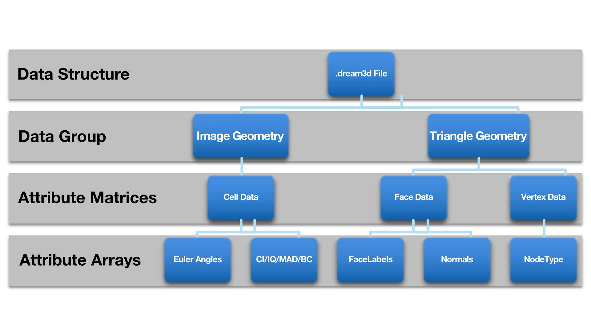
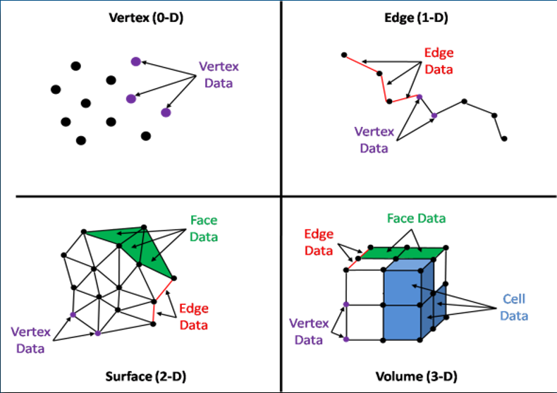
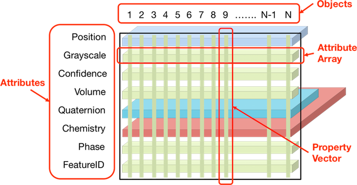
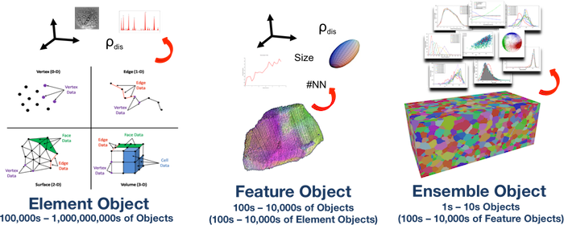

DREAM3D Introduction
====================

Overview
--------

DREAM.3D uses an *abstract*, *hierarchical* data structure that has roots in the concepts of combinatorial topology and 
common methods for describing mesh structures. The generalized data structure follows a tree structure with the following possible node types:

- DataStructure: The top level object that holds a tree of *DataObjects*.

  - DataGroup: This *DataObject* can hold 1 or more *DataObjects*

    - AttributeMatrix: This is a special kind of *DataObject* that only holds *DataArray* objects where all *DataArray* 
    - objects must have the same number of Tuples. The AttributeMatrix is an exact corollary to the original AttributeMatrix from the previous version of DREAM.3D

  - DataArray: This *DataObject* holds the actual raw data values that are used within DREAM.3D NX. This can be anything 
  - from simple gray scale image data to multidimensional data. DREAM.3D utilizes a *flat* data storage approach, such t
  - hat even multidimensional data is allocated into a contiguous section of memory. This approach enables faster and more efficient compute times.
  - Geometry: This is another special *DataGroup* that represents any one of the geometric meshes that are supported in 
  - DREAM.3D NX. The supported geometric meshes are the following:

    - ImageData:
    - Rectilinear Grid:
    - Vertex
    - Edge
    - Triangle
    - Quad
    - Hexahedron
    - Tetrahedral

For most DREAM.3D functions, the user is given control over how to name the various objects within the *Data Structure* 
tree with most filters providing reasonable defaults.

--------------

   DREAM.3D Data Structure

--------------

Geometry
--------

A special kind of DataGroup is known as the **Geometry**, which defines the spatial organization of the data. The **Data Container** 
objects are responsible for holding **Geometries**. In general, this means that the distinguishing characteristic between two **Data Containers** 
is their associated **Geometry** objects. **Geometries** are generally classified by the *topology* of their unit **Element**, 
which is the smallest building block of the geometry. **Elements** can have 4 different dimensions: 0 (points), 1 (lines), 
2 (polygons), and 3 (polyhedra). In the DREAM.3D ontology, these are generally referred to as **Vertices**, **Edges**, **Faces**, and **Cells**.

--------------

   Unit Element Types

--------------

Data attributes can be associated with any of these element types, as long as that association makes sense for the given element topology. For example, a triangulated surface mesh can have **Vertex**, **Edge**, and **Face** data associated with it, but not **Cell** data, since a triangle has a 2-dimensional topology. To help the user keep track of the **Geometry** type associated with a particular **Data Container**, DREAM.3D sets default names of **Data Containers** to be prefixed with the **Geometry** type when applicable. For example, a **Data Container** containing an **Image Geometry** would have a default name **ImageDataContainer**. Of course, you can rename **Data Containers** if you prefer a different data scheme.

Currently Implemented Geometries

~~~~~~~~~~~~~~~~~~~~~~~~~~~~~~~~

+-------------+----------+------------------+---------------------------------------------------------------------------------------------------------------------------------------+
| Name        | Topology | Associated Data  | Description                                                                                                                           |
+=============+==========+==================+=======================================================================================================================================+
| Vertex      | 0        | Vertex           | A collection of points, commonly referred to as a *point cloud*                                                                       |
+-------------+----------+------------------+---------------------------------------------------------------------------------------------------------------------------------------+
| Edge        | 1        | Edge/Vertex      | A collection of edges defined by two vertices, forming *lines*                                                                        |
+-------------+----------+------------------+---------------------------------------------------------------------------------------------------------------------------------------+
| Triangle    | 2        | Face/Edge/Vertex | A collection of triangles; one type of *surface mesh*                                                                                 |
+-------------+----------+------------------+---------------------------------------------------------------------------------------------------------------------------------------+
| Quad        | 2        | Face/Edge/Vertex | A collection of quadrilaterals; one type of *surface mesh*                                                                            |
+-------------+----------+------------------+---------------------------------------------------------------------------------------------------------------------------------------+
| Image       | 3        | Cell             | A *structured*, *rectilinear* grid; this **Geometry** is composed of *pixels* (in 2D) or *voxels* (in 3D) with constant resolution    |
+-------------+----------+------------------+---------------------------------------------------------------------------------------------------------------------------------------+
| RectGrid    | 3        | Cell             | An *unstructured*, *rectilinear* grid; this **Geometry** is composed of *pixels* (in 2D) or *voxels* (in 3D) with variable resolution |
+-------------+----------+------------------+---------------------------------------------------------------------------------------------------------------------------------------+
| Tetrahedral | 3        | Cell             | A collection of tetrahedra; one type of *volume mesh*                                                                                 |
+-------------+----------+------------------+---------------------------------------------------------------------------------------------------------------------------------------+
| Hexahedron  | 3        | Cell             | A collection of hexahedra; one type of *volume mesh*                                                                                  |
+-------------+----------+------------------+---------------------------------------------------------------------------------------------------------------------------------------+

Attribute Matrices & Data Hierarchy
-----------------------------------

Data is organized in DREAM.3D using **Attribute Matrix** or **DataGroups** objects. These objects themselves do not store data; instead, they store **Data Arrays**, which are the low-level containers for contiguous regions of data. There are a variety of different types of **Attribute Matrices**:

-  **Element**: Attribute data associated directly with the features of the **Geometry** objects. Types of **Element Attribute Matrices** include:

   -  **Vertex**: Attribute data associated with vertices
   -  **Edge**: Attribute data associated with edges
   -  **Face**: Attribute data associated with polygons
   -  **Cell**: Attribute data associated with polyhedra

-  **Feature**: Attribute data associated with *collections* of **Elements**
-  **Ensemble**: Attribute data associated with *collections* of **Features**

The four different types of **Element Attribute Matrix** correspond to the four possible levels of dimensional topology for a given **Geometry**. For example, a **Triangle Geometry** may have a **Vertex Attribute Matrix** that stores an **Attribute Array** that defines a scalar at each vertex, and a **Face Attribute Matrix** that defines a vector on every triangle. This example points out one of the advantages of the DREAM.3D data structure: data with any amount of dimensionality can be stored efficiently thanks to the generic *object-attribute* associations. Note as well that the **Attribute Matrix** itself defines the *tuple dimensions* for a given kind of data, whereas the **Data Arrays** in that **Attribute Matrix** define the *component dimensions* of the raw data. For example, consider a **Triangle Geometry** with 20 triangles. A **Face Attribute Matrix** for this **Geometry** will have 20 *tuples*; i.e., the number of triangles. An associated scalar **Attribute Array** in this **Face Attribute Matrix** will also have a *tuple* length of 20, since 20 x 1 = 20. But an **Attribute Array** that defines a vector (such as a normal for each triangle) would have 3 components. This vector array is still associated with the triangles, so it is stored in the **Face Attribute Matrix**. The total number of *elements* for the underlying array in this case is now 60, since 20 x 3 = 60.

--------------

   Attribute Matrix Layout

--------------

A given **Data Container** should only have at most one type of each of the different 
varieties of **Element Attribute Matrix**. This arises because a given **Geometry** should 
only have one way to organize its unit elements in space (e.g., the number of triangles 
in a **Triangle Geometry** remains fixed). If the number of any components in a **Geometry** 
change, then that defines a new **Geometry** that should belong in a new **Data Container** 
with new associated **Attribute Matrices**. Note that if the elements of a **Geometry** 
merely *move* (e.g., via a mesh smoothing process), then there is no need to instantiate 
new **Attribute Matrices**, since the underlying *tuple* dimensions have remained constant.

The underlying **Elements** of a given **Geometry** can be *grouped* together to form 
collections of **Elements** via some classification rule. A common example is *segmenting* 
a grayscale image by assigning all pixels with less than a certain grayscale value to class 1, 
and all others to class 2. This procedure introduces a sense of *hierarchy* to a data stream. 
DREAM.3D refers to these collections of **Elements** as **Features**. These **Features** can then have 
data associated with them through a **Feature Attribute Matrix**. Any kind of **Element** may be grouped into 
**Features**, thus there are many ways to group said **Elements**. Therefore, **Data Containers** can generally 
contain as many **Feature Attribute Matrices** as are necessary. To continue the hierarchy scale, DREAM.3D allows 
for **Features** to be grouped together to form **Ensembles**. Again, these **Ensembles** can have 
associated **Ensemble Attribute Matrices** to store data, and there may be many **Ensemble Attribute Matrices**
in a given **Data Container**. In principle, it is even possible to have **Ensembles** of **Ensembles**!
In this manner, the DREAM.3D data structure allows data associations to bridge across multiple length scales.

Both **Features** and **Ensembles** must be made up of some specific **Element** type 
at the lowest level. DREAM.3D currently requires that any set of **Features** (and thus 
**Ensembles** as well) must be composed of the *same* unit **Element** type. For example, 
**Features** can be made up of a collection of **Triangles**, but not both **Edges** and 
**Triangles**. Of course, it is possible to have a set of **Features** made up of **Edges** 
only and a set of **Features** made up of **Triangles** only within the same **Triangle Geometry**. 
To help the user keep track of these distinctions, DREAM.3D names **Feature/Ensemble Attribute Matrices** 
with a prefix that identifies the unit **Element** building block by default. For example, a set of **Features** 
made up of **Cells** would have a default **Attribute Matrix** name of **CellFeatureData**. 
Of course, you can rename **Attribute Matrices** if you prefer a different data scheme.

A key concept behind **Features** and **Ensembles** is the existence of a *map* that 
ties the entries in a **Feature/Ensemble Attribute Matrix** to one level lower in the 
hierarchy. The values in this map are commonly referred to as *Ids*. For example, consider 
an **Image Geometry** in 2D that has a set of 10 **Features** within it, defined by
10 groups of pixels. The **Attribute Matrix** associated with this set of **Features**
will have *11* tuples. Why 11 and not 10? DREAM.3D begins numbering **Features** and
**Ensembles** at 1, and reserves the *0* value for special use. Therefore, the number
of tuples for a given **Feature/Ensemble Attribute Matrix** is always one larger than
the actual number of **Features/Ensembles**. Since the **Features** are groups of pixels
(a kind of **Element**), DREAM.3D associates each pixel with a particular **Feature**.
These *Feature Id* values correspond to integers that sit on the pixel **Elements**,
and allow DREAM.3D to index into the **Feature Attribute Matrix** by knowing the *Feature Id*
at one level lower in the hierarchy. The same concept applies to *Ensemble Ids* sitting at the **Feature** level.
These *map* associations enable DREAM.3D to efficiently *link* between the various hierarchy
scales, allowing for connections and correlations to be assessed.

--------------

   Object-Attribute Associations

--------------

For a detailed discussion of the DREAM.3D data structure and its associated applications
to the analysis of microstructure data, please consult this `IMMI paper <http://www.immijournal.com/content/3/1/5/abstract>`__.

Filters, Pipelines & Plugins
----------------------------

Manipulation of the underlying data structure is exposed to the user through the use 
of **Filters**. A **Filter** can be considered a self-contained *function*, which takes the existing data structure as input and performs some series of operations to modify the data structure and produce and output. **Filters** can be strung together to form a **Pipeline**, in which the data structure flows through the set of **Filters**, being modified along the way. If a **Filter** reads in data from outside of DREAM.3D, then the new data will be incorporated into the existing data structure. Or, if no data structure yet exists (e.g, starting from a “blank slate”), a new one will be created. More information on creating **Pipelines** can be found in the ‘Creating A Pipeline’ section.

**Filters** in DREAM.3D are contained within **Plugins**, which are collections of
**Filters** with similar scope. The **Plugin** itself is the actual *library* into
which the **Filters** are compiled. The **Filters’** are listed in the interface
alphabetically by their name, and may not correspond to their actual **Plugin** library.
For more information about how to find **Filters** in the interface, see the Filter List View section.
