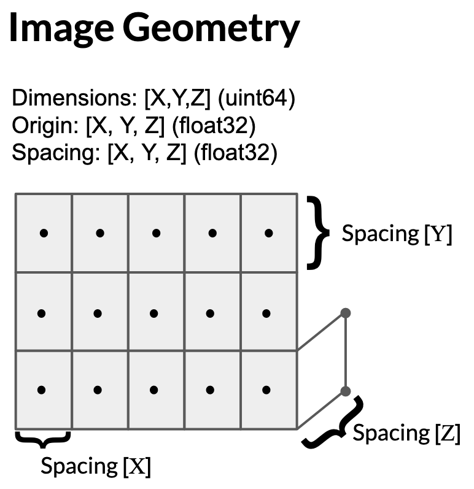
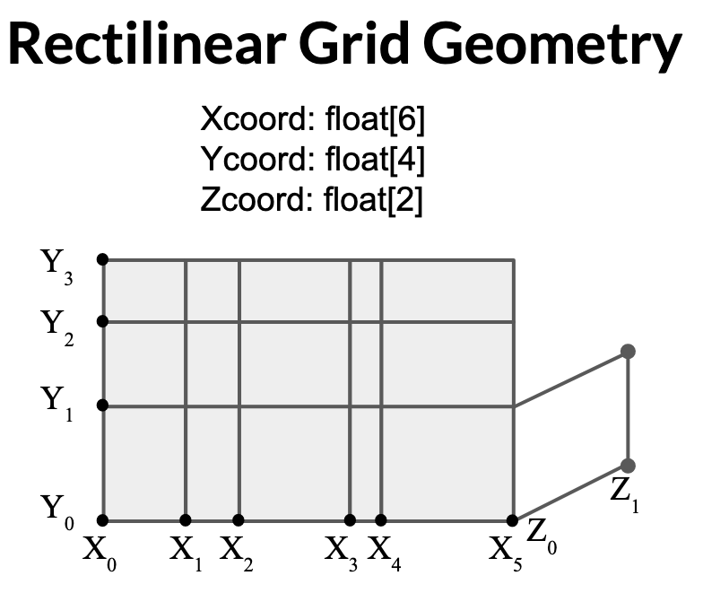
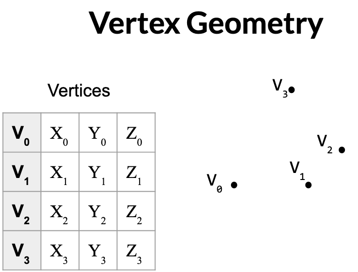
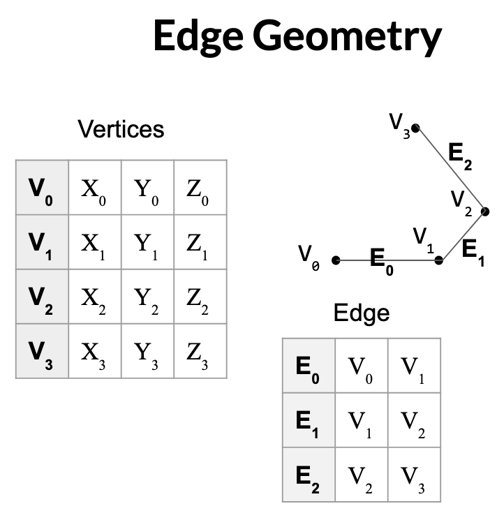
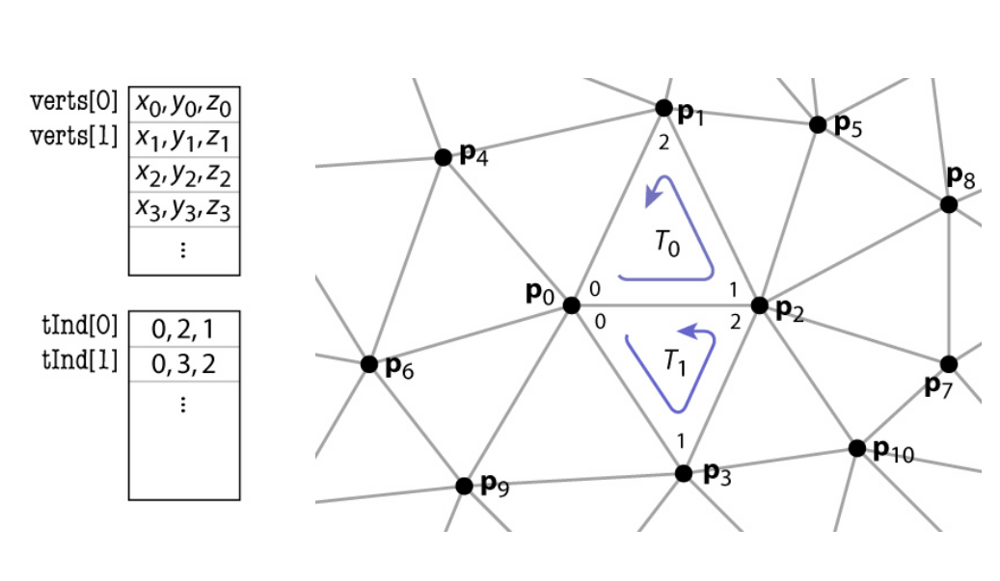
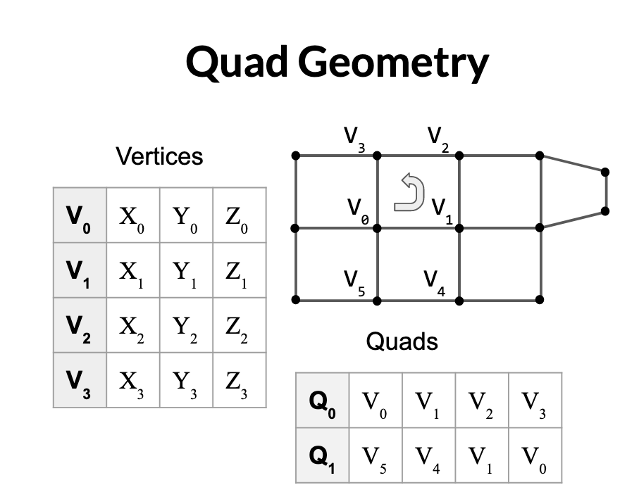

.. _Geometry Descriptions:

Geometry Descriptions
=====================

DREAM3D-NX is capable of working with several different kinds of geometric grids that describe the spatial location
of geometric features in regular cartesian space. There are three main types of geometric grids in DREAM3D-NX:

- Regular Grid
- Semi-Regular Grid
- Unstructured Grids

.. _ImageGeom:

Image Geom (Regular Grid)
-------------------------

A *structured grid*, this :ref:`Geometry<Geometry Descriptions>` is composed of *pixels* (in 2D) or 
*voxels* (in 3D) with constant spacing along each axis. The voxel is a primary three-dimensional cell. 
The voxel is topologically equivalent to the hexahedron with additional geometric 
constraints. Each face of the voxel is perpendicular to one of the coordinate x-y-z axes.

When creating an ImageGeometry the dimension values are specified as X, Y, Z, *IN THAT ORDER* since this
is most natural way to express a 3-dimensional cube. If you are going to be using an AttributeMatrix with the
Image Geometry, note that the tuple dimensions will be given in **ZYX** order since the tuple dimensions
are **ALWAYS** given in "C" order, or slowest to fastest order.

   Definition of Image Geometry

.. py:class:: ImageGeom

   :ivar dimensions: Returns dimensions of the Image Geometry in [XYZ] as integers
   :ivar spacing: Returns the spacing of the Image Geometry in [XYZ] as float32
   :ivar origin: Returns the origin of the Image Geometry in [XYZ] as float32
   :ivar num_x_cells: Returns the number of Cells along the X Axis.
   :ivar num_y_cells: Returns the number of Cells along the Y Axis.
   :ivar num_z_cells: Returns the number of Cells along the Z Axis.

.. _RectGridGeometry:

RectilinearGrid Geometry (Semi-Regular Grid)
--------------------------------------------

An *rectilinear grid*; this :ref:`Geometry<Geometry Descriptions>` is composed of *pixels* (in 2D) or *voxels* 
(in 3D) with variable spacing along each axis. RectilinearGrid represents a geometric structure 
that is topologically regular with variable spacing in the three coordinate directions x-y-z.
To define a RectilinearGrid, you must specify the dimensions of the 3 axis and provide 
three arrays of values specifying the coordinates along the x-y-z axes. The coordinate arrays are 
specified using three DataArray objects (one for X, one for Y, one for Z).

In the figure below, the geometry has dimensions of X=5, Y=3 and Z=1 but note that the number of values
in each array is +1 from the dimension size.

   Definition of RectGrid Geometry

.. py:class:: RectilinearGrid

   :ivar dimensions: Returns dimensions of the Image Geometry in [XYZ] as integers
   :ivar num_x_cells: Returns the number of Cells along the X Axis.
   :ivar num_y_cells: Returns the number of Cells along the Y Axis.
   :ivar num_z_cells: Returns the number of Cells along the Z Axis.
   :ivar x_bounds: Returns the axis values along the X Axis
   :ivar y_bounds: Returns the axis values along the Y Axis
   :ivar z_bounds: Returns the axis values along the Z Axis

.. code:: python

    # This code snippet assumes the developer has already generated the
    # needed DataArrays and added them to the DataStructure through the proper
    # CreateDataArray filters (or any other way)
    result = cx.CreateGeometryFilter.execute(data_structure=data_structure,
        array_handling= 1,  # Move the arrays from their original location.
        cell_attribute_matrix_name="Cell Data",
        geometry_name=cx.DataPath(["RectGrid Geometry"]),
        geometry_type=1,
        x_bounds=cx.DataPath("RectGridCoords/X Coords"),
        y_bounds=cx.DataPath("RectGridCoords/Y Coords"),
        z_bounds=cx.DataPath("RectGridCoords/Z Coords")
      )
    if len(result.errors) != 0:
        print('Errors: {}', result.errors)
        print('Warnings: {}', result.warnings)
    else:
        print("No errors running the CreateGeometryFilter filter")

    rect_grid_geom = data_structure[cx.DataPath(["RectGrid Geometry"])]
    x_cell_count = rect_grid_geom.num_x_cells
    print(f'num_x_cells: {x_cell_count}')
    x_bounds = rect_grid_geom.x_bounds
    print(f'x_bounds: {x_bounds.store.npview()}')

The output produced is:

::

    num_x_cells: 9
    x_bounds: [[0.]
    [1.]
    [2.]
    [3.]
    [4.]
    [5.]
    [6.]
    [7.]
    [8.]
    [9.]]

Node Based Geometries (Unstructured Grid)
-----------------------------------------

These are geometries that consist of an array of vertices (points) where each vertex is
defined by a vector of 3 x 32 bit floating point values representing the X, Y, and Z value for that point. Each vertex could be shared by 0 or more higher order elements.
The higher dimensional node geometries will also include a second array that defines the topology or connectivity of
each element (edge, triangle, ...) for that geometry.

VertexGeometry
^^^^^^^^^^^^^^^^

A collection of points, commonly referred to as a *point cloud*. The vertex is a primary zero-dimensional cell. It is defined by a single point.

  Array of vertex positions
  - float[nV][3]: 12 bytes per vertex
  - (3 coordinates x 4 bytes) per vertex

   Definition of Vertex Geometry

EdgeGeometry
^^^^^^^^^^^^^^^^

A collection of edges defined by two vertices, forming *lines*. The line is a 
primary one-dimensional cell. It is defined by two points. The direction along the line is from the first point to the second point.

   Definition of Edge Geometry

Inherits from VertexGeometry and adds the following:

- array of pairs of indices (per edge)

  - (2 indices x 8 bytes) per edge
  - 16 bytes per edge

- represents topology and geometry separately
- finding neighbors is at least well defined

TriangleGeometry
^^^^^^^^^^^^^^^^

The triangle is a primary two-dimensional cell. The triangle is a primary 
two-dimensional cell. The triangle is defined by a counterclockwise 
ordered list of three points. The order of the points specifies the direction of the surface normal using the right-hand rule.

   Definition of Triangle Geometry

Inherits from VertexGeometry and adds the following:

- array of triples of indices (per triangle)

  - (3 indices x 8 bytes) per triangle
  - 24 bytes per triangle

- represents topology and geometry separately
- finding neighbors is at least well defined

QuadGeometry
^^^^^^^^^^^^^^^^

A collection of quadrilaterals; one type of *surface mesh* . The quadrilateral is a primary 
two-dimensional cell. It is defined by an ordered list of four points lying in a plane. The quadrilateral
is convex and its edges must not intersect. The points are ordered counterclockwise around the quadrilateral, 
defining a surface normal using the right-hand rule.

Inherits from VertexGeometry and adds the following:

- array of triples of indices (per quad)

  - (4 indices x 8 bytes) per quad
  - 32 bytes per quad

- represents topology and geometry separately
- finding neighbors is at least well defined

   Definition of Quad Geometry

HexahedralGeometry
^^^^^^^^^^^^^^^^^^^

A collection of hexahedra; one type of *volume mesh*. The hexahedron is a primary three-dimensional 
cell consisting of six quadrilateral faces, twelve edges, and eight vertices. The hexahedron is defined by an ordered list of eight points. The faces and edges must not intersect any other faces and edges, and the hexahedron must be convex.

Inherits from QuadGeometry and adds the following:

- array of triples of indices (per hexahedra)

  - (8 indices x 8 bytes) per hexahedra
  - 64 bytes per hexahedra

- represents topology and geometry separately
- finding neighbors is at least well defined

TetrahedralGeometry
^^^^^^^^^^^^^^^^^^^^

 A collection of tetrahedra; one type of *volume mesh*. The tetrahedron is a primary three-dimensional 
 cell. The tetrahedron is defined by a list of four non-planar points. The tetrahedron has six edges and four triangular faces.
 
 Inherits from TriangleGeometry and adds the following:

- array of triples of indices (per tetrahedra)

  - (4 indices x 8 bytes) per tetrahedra
  - 32 bytes per tetrahedra

- represents topology and geometry separately
- finding neighbors is at least well defined

