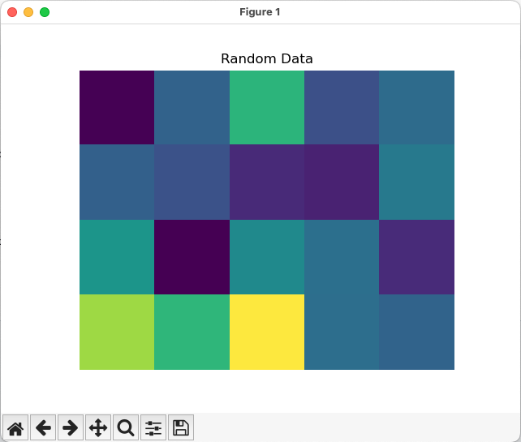

.. _Tutorial_1:

=====================================
Tutorial 1: Basic Python Integration
=====================================

This tutorial is meant to be a very basic introduction to interacting with the DREAM3D-NX underlying library called 'simplnx'. This
tutorial will cover the following topics:

- Environment setup
- Minimal import statements
- Executing a few basic filters
- Accessing your data through a Numpy View

Once you understand how to execute a filter, all filters are generally setup the same way. Use the search feature on the web site to find the filter 
that you are interested in running.

.. _Tutorial_1_Setup:

#########################################
1.1 Anaconda Virtual Environment Setup
#########################################

.. code:: shell

      conda config --add channels conda-forge
      conda config --set channel_priority strict
      conda create -c bluequartzsoftware -n nxpython python=3.12 dream3dnx matplotlib
      conda activate nxpython
  
.. _Tutorial_1_Intro:

###################################
1.2 Introduction
###################################

Setup your virtual environment following the directions from above. Then create a Tutorial_1.py file anywhere that you want and open that up in your Editor/IDE.

.. _Tutorial_1_Imports:

###################################
1.3 Necessary Import Statements
###################################

Just about every python source code that is written will need the following import Statements:

.. code:: python

    import simplnx as nx
    import numpy as np

If you will be using filters from DREAM3D-NX's other plugins, then you may additionally need the following:

.. code:: python

    import itkimageprocessing as nxitk
    import orientationanalysis as nxor

Also use these import statements:

.. code:: python

    from pathlib import Path
    import matplotlib.pyplot as plt

###################################
1.4 Set Output Directory
###################################

Set the output directory where the output from this tutorial will be stored, and create the directory.  We are going to set the output directory in the same location as the current script.

.. code:: python

    output_dir = Path(__file__).parent / 'Output' / 'Tutorial_1_Output'
    output_dir.mkdir(exist_ok=True, parents=True)

#########################################
1.5 Creating the DataStructure Object
#########################################

If you will be interacting with data stored in DREAM3D-NX, you will need to instantiate a :ref:`DataStructure` object. This is 
simply done with the following line of code:

.. code:: python

    # Create the DataStructure Object
    data_structure = nx.DataStructure()

A few caveats to take note of:
1. You can have as many :ref:`DataStructure` objects as you want/need. Typically all data is stored in a single DataStructure object but there are use cases where having more than a single :ref:`DataStructure` object is needed.
2. Only a **single** :ref:`DataStructure` object can be stored in a .dream3d file. 

######################################################
1.6 First Steps: Create a Group in the DataStructure
######################################################

As in the user interface of DREAM3D-NX, you as the developer can execute any of the filters from DREAM3D-NX using only Python codes. This is performed
by instantiating the filter and then calling the `execute()` method with the appropriate parameters used in the call. With the current API, we are tending to
inline instantiate the filter and execute it all in the same line. Some things to note with this small piece of code:

- There will **always** be a required :ref:`DataStructure` object. All arguments in the `execute()` method are named arguments. None are positional. This means that each argument must be in the form of 'name=value'.
- The 2nd argument shows a use of the :ref:`DataPath` object. Lots of filters will require a :ref:`DataPath` object so this is a common use.
- There is a method called `hierarchy_to_str()` that is a part of the :ref:`DataStructure` class which will print the heirarchy of the DataStructure.

.. code:: python

    result = nx.CreateDataGroupFilter.execute(data_structure=data_structure, 
                                    data_object_path=nx.DataPath("Top Level Group"))
    print(f'{data_structure.hierarchy_to_str()}')

If we were to run this code we would get the following:

.. code:: text

    |--Top Level Group

****************************************
1.6.1 Adding Multiple Groups (Optional)
****************************************

Let's try to add a bunch of groups to the :ref:`DataStructure` object by using a loop:

.. code:: python

    for i in range(1, 6):
    
        current_data_group_path = nx.DataPath(f"Top Level Group {i}")
        result = nx.CreateDataGroupFilter.execute(data_structure=data_structure, 
                                            data_object_path=current_data_group_path)
    print(f'{data_structure.hierarchy_to_str()}')

And the output would look like the following:

.. code:: text

    |--Top Level Group 1
    |--Top Level Group 2
    |--Top Level Group 3
    |--Top Level Group 4
    |--Top Level Group 5

  

################################################
1.7 Result Objects
################################################

Each time a filter is executed, it will return a :ref:`nx.IFilter.ExecuteResult <result>` object. This 
object can be interrogated for both warnings and errors that occured while the 
filter was executing. A typical function that can be written to properly error
check the 'result' value is the following:

.. code:: python

    def check_filter_result(filter: nx.IFilter, result: nx.IFilter.ExecuteResult) -> None:
        """
        This function will check the `result` for any errors. If errors do exist then a 
        `RuntimeError` will be thrown. Your own code to modify this to return something
        else that doesn't just stop your script in its tracks.
        """
        if len(result.warnings) != 0:
            for w in result.warnings:
                print(f'Warning: ({w.code}) {w.message}')
        
        has_errors = len(result.errors) != 0 
        if has_errors:
            for err in result.errors:
                print(f'Error: ({err.code}) {err.message}')
                raise RuntimeError(result)
        else:
            print(f"{filter.name()} :: No errors running the filter")

If you were to integrate this into your own code, then we would get the following when we wanted to execute a filter:

.. code:: python

    result = nx.CreateDataGroupFilter.execute(data_structure=data_structure, 
                                    data_object_path=nx.DataPath("Top Level Group"))
    check_filter_result( nx.CreateDataGroupFilter(), result)

################################################
1.8 Creating a DataArray Object
################################################

Raw data is stored in a :ref:`DataArray` object within the :ref:`DataStructure`. The DREAM3D-NX python bindings only expose a subset of functionality
from the :ref:`DataArray`, enough to get the name, tuple shape and component shape. **ALL** interactions to modify a :ref:`DataArray` are done via a 
`numpy view <https://numpy.org/doc/stable/user/basics.copies.html>`_. Let us first create a :ref:`DataArray` object within the :ref:`DataStructure` by using the
:ref:`CreateDataArrayFilter <CreateDataArrayFilter>` filter. Adding into the current python source file... 

.. code:: python

    result = nx.CreateDataArrayFilter().execute(data_structure=data_structure, 
                                            component_dimensions=[[1]],
                                            init_value="0", 
                                            numeric_type_index=nx.NumericType.float32, 
                                            output_array_path=nx.DataPath("Top Level Group/2D Array"), 
                                            tuple_dimensions=[[5,4]])
    check_filter_result( nx.CreateDataArrayFilter(), result)
    print(f'{data_structure.hierarchy_to_str()}')

Note how we are creating the array inside the very first :ref:`DataGroup` that we created. If we run the file from start to finish we now get the following output:

.. code:: text

    |--Top Level Group
      |--2D Array
    |--Top Level Group 1
    |--Top Level Group 2
    |--Top Level Group 3
    |--Top Level Group 4
    |--Top Level Group 5

As you can see we have successfully created an array that can hold some data. The next step is to interact with that :ref:`DataArray` and use numpy to modify the array in place.

################################################
1.9 Modifying the DataArray Object using Numpy
################################################

The method from :ref:`DataStructure` that we will be using is item selection using the '[]' operator paired with an 
immediate call to the '.npview()' method. This will retrieve the a numpy view of the DataArray that was created in the last step.

.. code:: python

    array_view = data_structure["Top Level Group/2D Array"].npview()

Now that we have a numpy view we can do anything to the array that numpy (or any other package that accepts numpy views) can do for us. For example, we can
create random data in the array using the following:

.. code:: python

    # Fill the numpy data view with random numbers
    rng = np.random.default_rng()
    rng.standard_normal(out=array_view, dtype=np.float32)
    print(f'{array_view}')

The output from this code would print something similar to:

.. code:: text

    [[[-1.3746183 ]
    [-0.08409024]
    [ 1.2792562 ]
    [-0.37265882]
    [ 0.05201177]]

    [[-0.11597582]
    [-0.35329401]
    [-0.88307136]
    [-0.98040694]
    [ 0.28385338]]

    [[ 0.7635286 ]
    [-1.3911186 ]
    [ 0.5670461 ]
    [ 0.11915083]
    [-0.8656706 ]]

    [[ 2.1133974 ]
    [ 1.3168721 ]
    [ 2.6951575 ]
    [ 0.10712756]
    [-0.07898012]]]

And if you wanted to use `matplotlib <https://matplotlib.org/>`_ to view the data, that is easily done in the usual manner:

.. code:: python

    # Show the result
    plt.imshow(array_view)
    plt.title("Random Data")
    plt.axis('off')  # to turn off axes
    plt.show()

################################################
1.10 Saving your Data to a .dream3d file
################################################

Most pipelines would want to save any modified data to a .dream3d file (if you are wanting the easiest compatibility with DREAM3D-NX). In order
to do this one would run the :ref:`WriteDREAM3DFilter <WriteDREAM3DFilter>`. Appending the following code will write the entire
:ref:`DataStructure` to a .dream3d file (which is a plain HDF5 file).

.. code:: python

    # Use the WriteDREAM3DFilter to write out the modified DataStructure to disk
    result = nx.WriteDREAM3DFilter.execute(data_structure=data_structure,
                                        export_file_path=str(output_dir / 'tutorial_1.dream3d'),
                                        write_xdmf_file=False)
    check_filter_result( nx.WriteDREAM3DFilter(), result)

#################
1.11 Full Example
#################

Full example of this tutorial is located at:

https://github.com/BlueQuartzSoftware/NXWorkshop/blob/develop/PythonTutorial/tutorial_1.py

