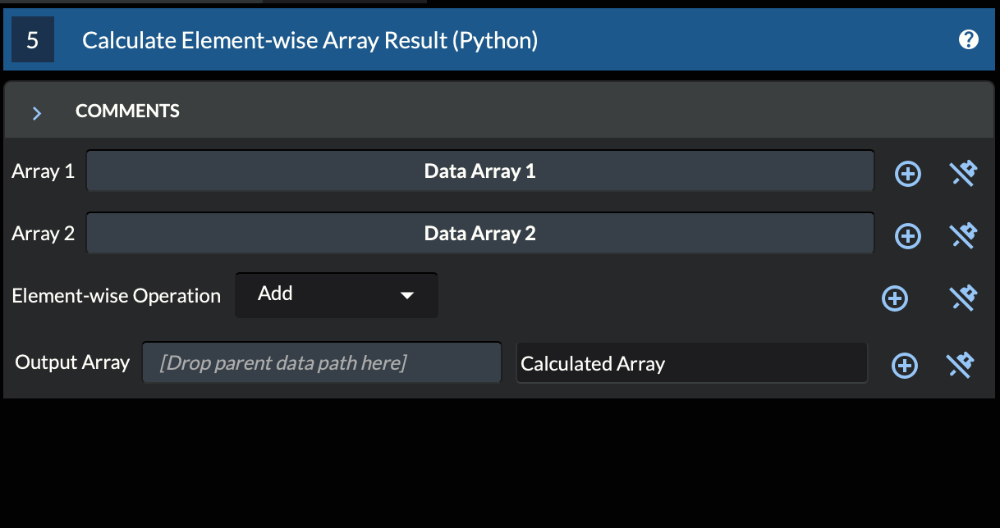

.. _Tutorial_3:

==============================================
Tutorial 3: Writing a Custom DREAM3D-NX Filter
==============================================

In this tutorial, we will learn how to write a custom filter for DREAM3D-NX. We will use the `Create Python Plugin and/or Filters` filter to generate the skeleton code and then fill in the `default_tags`, `parameters`, `preflight_impl`, and `execute_impl` methods.

###########################################
3.1 Generating the Filter's Python Skeleton
###########################################

Python filters for `simplnx` are contained in Python plugins.  `simplnx` loads Python plugins at startup and makes the filters in each plugin available for use in the application.

The first step in creating a new Python plugin with a custom Python filter inside it is to generate the skeleton code for both. DREAM3D-NX provides a convenient filter called `Create Python Plugin and/or Filters` to help with this.

Open the DREAM3D-NX application, and add the `Create Python Plugin and/or Filters` filter to the pipeline.

3.1.1 Configuring and Executing the Skeleton Generation Filter
--------------------------------------------------------------

The `Create Python Plugin and/or Filters` filter has the following inputs:

- **Use Existing Plugin**: Checking this checkbox will generate the skeleton code for new filters into an existing plugin.  Leaving the checkbox unchecked will generate skeleton code for a new plugin AND generate skeleton code for filters inside that new plugin.  The inputs that follow this checkbox will change depending on whether the checkbox is checked or not.

When Creating a New Plugin (**Use Existing Plugin** is unchecked)
*****************************************************************

- **Name of Plugin**: This field specifies the name of your plugin. This name will be used as the directory name for your plugin and as the identifier for your plugin within the generated skeleton code.

- **Human Name of Plugin**: This is the user-friendly name of your plugin. It can be the same as the `Name of Plugin` or a more descriptive name.  This is the name that will be used when your filter appears in the Filter List.

- **Plugin Output Directory**: This specifies the directory where the generated plugin and filter files will be saved. You can select the directory by clicking the `Save` button.

- **Filter Names (comma-separated)**: This field allows you to specify the programmatic names of the filters you want to create. Each filter name should be separated by a comma.  For example, `FirstFilter,SecondFilter`.

When Using an Existing Plugin (**Use Existing Plugin** is checked)
*******************************************************************

- **Existing Plugin Location**: This specifies the directory of the existing plugin to which you want to add new filters. You can select the directory by clicking the `Browse` button.

- **Filter Names (comma-separated)**: This field allows you to specify the programmatic names of the filters you want to create. Each filter name should be separated by a comma.  For example, `FirstFilter,SecondFilter`.

We are going to generate a new plugin and filters, so let's set the following inputs:

- **Use Existing Plugin**: Unchecked
- **Name of Plugin**: ExamplePlugin
- **Human Name of Plugin**: Example Plugin
- **Plugin Output Directory**: /plugin/output/directory (please fill this in with an actual output directory!)
- **Filter Names (comma-separated)**: ArrayCalculationFilter

These settings will generate a new plugin called `ExamplePlugin` at `/plugin/output/directory`.  Inside the `ExamplePlugin`, the skeleton code for a new filter called `ArrayCalculationFilter` will be generated in a Python file called `ArrayCalculationFilter.py`.

After configuring these inputs, execute the filter.  Any existing files with the same names will be overwritten.

Your newly generated plugin should have a file structure that looks like the following:

3.1.2 Loading The New Python Plugin
-----------------------------------

Next, we need to load the newly generated Python plugin into DREAM3D-NX.  Open DREAM3D-NX and then open the Preferences panel found in the file menu.  Navigate to the Python tab.

.. figure:: Images/Tutorial_3/plugin_loading_1.png

Press the "plus" button on the right side to add the plugin to the list.  You need to pick the internal plugin source directory, not the top-level directory, so the path should be something like `/plugin/output/directory/ExamplePlugin/src/ExamplePlugin`.

Press the OK button, and then DREAM3D-NX will automatically load the `ExamplePlugin` plugin for you.  You should now be able to see your filter in the Filter List if you search for `ArrayCalculationFilter (Python)`.

Now, navigate to `/plugin/output/directory/ExamplePlugin/src/ExamplePlugin` on the file system and open `ArrayCalculationFilter.py`.

Let's begin editing `ArrayCalculationFilter's` skeleton methods.

################################
3.2 Editing the Generated Filter
################################

We are going to edit this custom filter to have the filter take in two arrays, perform an element-wise calculation, and then store the result in an output array.

Let's begin by editing the `human_name`, `default_tags`, `parameters`, `preflight_impl`, and `execute_impl` methods.  All other methods should remain untouched.

3.2.1 Editing the Human Name
----------------------------

The `human_name` method in a DREAM3D-NX filter returns a user-friendly name for the filter. This name is displayed in the DREAM3D-NX interface, making it easier for users to understand the purpose of the filter. Editing the `human_name` method allows developers to provide a clear and descriptive name that enhances the usability of the filter.

.. code:: python

    def human_name(self) -> str:
        """This returns the name of the filter as a user of DREAM3DNX would see it
        :return: The filter's human name
        :rtype: string
        """
        return 'ArrayCalculationFilter (Python)'

Let's update the human name so that it is easier to read:

.. code:: python

    def human_name(self) -> str:
        """This returns the name of the filter as a user of DREAM3DNX would see it
        :return: The filter's human name
        :rtype: string
        """
        return 'Calculate Element-wise Array Result (Python)'

This name does not have to match the filter's class name; it can be updated to display any name that you want.  This human-readable name will be displayed in the DREAM3D-NX interface wherever the filter is listed, making it easy for users to identify the filter.

We typically include the term `Python` in parenthesis at the end, just to make it clear to users in the GUI that this is a Python filter.

3.2.2 Editing the Default Tags
------------------------------

The `default_tags` method allows the filter developer to define a set of tags for the filter. These tags can be used to categorize and search for your filter within the DREAM3D-NX interface.

.. code:: python

    def default_tags(self) -> List[str]:
        """This returns the default tags for this filter
        :return: The default tags for the filter
        :rtype: list
        """
        return ['python', 'ArrayCalculationFilter']

In this example, the `default_tags` method returns a list of tags associated with the filter. These tags can be keywords that describe the filter's functionality, category, or any other relevant information.

We can update the tags to include a few more terms:

.. code:: python

    def default_tags(self) -> List[str]:
        """This returns the default tags for this filter
        :return: The default tags for the filter
        :rtype: list
        """
        return ['python', 'ArrayCalculationFilter', 'compute', 'generate']

Now when the user searches for `compute` or `generate` in the DREAM3D-NX interface, this filter will be matched and listed.

3.2.3 Defining Filter Parameters
--------------------------------

Next, we need to define the parameters that our filter will accept. These parameters will be used by the filter during its execution. Parameters are essential as they allow users to input values that will be utilized in the filter's logic.

The `parameters` method is where we define the parameters for our filter. Each parameter is given a key, which should be in snake_case, and a descriptive name in ALL_CAPS. This method returns an `nx.Parameters` object that collects these parameters.

**NOTE**: The skeleton code will have example parameters and example keys, so please remove those so that your keys and `parameters` method look like this:

.. code:: python

    """
    This section should contain the 'keys' that store each parameter. The value of the key should be snake_case. The name
    of the value should be ALL_CAPITOL_KEY
    """

    def parameters(self) -> nx.Parameters:
        """This function defines the parameters that are needed by the filter. Parameters collect the values from the user interface
        and pack them up into a dictionary for use in the preflight and execute methods.
        """
        params = nx.Parameters()

        return params

We want this filter to take in two existing arrays, so that means we need to use two ArraySelectionParameters:

.. code:: python

    """
    This section should contain the 'keys' that store each parameter. The value of the key should be snake_case. The name
    of the value should be ALL_CAPITOL_KEY
    """
    ARRAY_1_PATH_KEY = 'array_1_path'
    ARRAY_2_PATH_KEY = 'array_2_path'

    def parameters(self) -> nx.Parameters:
        """This function defines the parameters that are needed by the filter. Parameters collect the values from the user interface
        and pack them up into a dictionary for use in the preflight and execute methods.
        """
        params = nx.Parameters()

        params.insert(nx.ArraySelectionParameter(name=ArrayStatisticsFilter.ARRAY_1_PATH_KEY, human_name='Array 1', help_text='The 1st array that will be used in the statistics calculations', default_value=nx.DataPath(), allowed_types={nx.DataType.float32, nx.DataType.float64}, required_comps=[[1]]))
        params.insert(nx.ArraySelectionParameter(name=ArrayStatisticsFilter.ARRAY_2_PATH_KEY, human_name='Array 2', help_text='The 2nd array that will be used in the statistics calculations', default_value=nx.DataPath(), allowed_types={nx.DataType.float32, nx.DataType.float64}, required_comps=[[1]]))

        return params

Above, we define two ArraySelectionParameters with keys `ARRAY_1_PATH_KEY` and `ARRAY_2_PATH_KEY` (defined above the parameters method), human names `Array 1` and `Array 2`, descriptive help text, empty default values (no array will be selected by default), floating-point arrays as the only allowable type, and a required component dimension of 1.

Here is what those two ArraySelectionParameters look like when launching the filter in the user interface:

We also need to allow the user to pick a mathematical operation to perform element-wise on the arrays.  To do this, we are going to add a ChoicesParameter:

.. code:: python

    """
    This section should contain the 'keys' that store each parameter. The value of the key should be snake_case. The name
    of the value should be ALL_CAPITOL_KEY
    """
    ARRAY_1_PATH_KEY = 'array_1_path'
    ARRAY_2_PATH_KEY = 'array_2_path'
    MATH_OPERATION_KEY = 'math_operation'

    def parameters(self) -> nx.Parameters:
        """This function defines the parameters that are needed by the filter. Parameters collect the values from the user interface
        and pack them up into a dictionary for use in the preflight and execute methods.
        """
        params = nx.Parameters()

        params.insert(nx.ArraySelectionParameter(name=ArrayStatisticsFilter.ARRAY_1_PATH_KEY, human_name='Array 1', help_text='The 1st array that will be used in the statistics calculations', default_value=nx.DataPath(), allowed_types={nx.DataType.float32, nx.DataType.float64}, required_comps=[[1]]))
        params.insert(nx.ArraySelectionParameter(name=ArrayStatisticsFilter.ARRAY_2_PATH_KEY, human_name='Array 2', help_text='The 2nd array that will be used in the statistics calculations', default_value=nx.DataPath(), allowed_types={nx.DataType.float32, nx.DataType.float64}, required_comps=[[1]]))

        params.insert(nx.ChoicesParameter(name=ArrayStatisticsFilter.MATH_OPERATION_KEY, human_name='Element-wise Operation', help_text='The operation to perform element-wise on both arrays.', default_value=0, choices=['Add', 'Subtract', 'Multiply', 'Divide']))

        return params

Above, we added a ChoicesParameter with a key called `MATH_OPERATION_KEY` (defined above the parameters method), human name `Element-wise Operation`, descriptive help text, default value of 0 (the first item in the choice list), and four text choices.

Here is what the parameters section looks like with the ChoicesParameter included:

When the user adjusts the combo box selection, the index for the current combo box selection gets stored in the `args` dictionary and can be retrieved during preflight and execute.

Finally, we want to create a new array to store the output, so to do that we will need to use a ArrayCreationParameter:

.. code:: python

    """
    This section should contain the 'keys' that store each parameter. The value of the key should be snake_case. The name
    of the value should be ALL_CAPITOL_KEY
    """
    ARRAY_1_PATH_KEY = 'array_1_path'
    ARRAY_2_PATH_KEY = 'array_2_path'
    MATH_OPERATION_KEY = 'math_operation'
    OUTPUT_ARRAY_KEY = 'output_array'

    def parameters(self) -> nx.Parameters:
        """This function defines the parameters that are needed by the filter. Parameters collect the values from the user interface
        and pack them up into a dictionary for use in the preflight and execute methods.
        """
        params = nx.Parameters()

        params.insert(nx.ArraySelectionParameter(name=ArrayStatisticsFilter.ARRAY_1_PATH_KEY, human_name='Array 1', help_text='The 1st array that will be used in the statistics calculations', default_value=nx.DataPath(), allowed_types={nx.DataType.float32, nx.DataType.float64}, required_comps=[[1]]))
        params.insert(nx.ArraySelectionParameter(name=ArrayStatisticsFilter.ARRAY_2_PATH_KEY, human_name='Array 2', help_text='The 2nd array that will be used in the statistics calculations', default_value=nx.DataPath(), allowed_types={nx.DataType.float32, nx.DataType.float64}, required_comps=[[1]]))

        params.insert(nx.ChoicesParameter(name=ArrayStatisticsFilter.MATH_OPERATION_KEY, human_name='Element-wise Operation', help_text='The operation to perform element-wise on both arrays.', default_value=0, choices=['Add', 'Subtract', 'Multiply', 'Divide']))

        params.insert(nx.ArrayCreationParameter(name=ArrayStatisticsFilter.OUTPUT_ARRAY_KEY, human_name='Output Array', help_text='The output array that contains the calculation results.', default_value=nx.DataPath()))

        return params

Above, we added a ArrayCreationParameter with a key called `OUTPUT_ARRAY_KEY` (defined above the parameters method), human name `Output Array`, descriptive help text, and an empty DataPath as the default value (empty by default).

Here is what the parameters section looks like with the ArrayCreationParameter included:

This is what the parameters look like when they have values:

Grouping Parameters (optional)
******************************
It's possible to group parameters using the Separator class:

.. code:: python

    """
    This section should contain the 'keys' that store each parameter. The value of the key should be snake_case. The name
    of the value should be ALL_CAPITOL_KEY
    """
    ARRAY_1_PATH_KEY = 'array_1_path'
    ARRAY_2_PATH_KEY = 'array_2_path'
    MATH_OPERATION_KEY = 'math_operation'
    OUTPUT_ARRAY_KEY = 'output_array'

    def parameters(self) -> nx.Parameters:
        """This function defines the parameters that are needed by the filter. Parameters collect the values from the user interface
        and pack them up into a dictionary for use in the preflight and execute methods.
        """
        params = nx.Parameters()

        params.insert(params.Separator("Input Parameters"))     # Group the input parameters
        params.insert(nx.ArraySelectionParameter(name=ArrayStatisticsFilter.ARRAY_1_PATH_KEY, human_name='Array 1', help_text='The 1st array that will be used in the statistics calculations', default_value=nx.DataPath(), allowed_types={nx.DataType.float32, nx.DataType.float64}, required_comps=[[1]]))
        params.insert(nx.ArraySelectionParameter(name=ArrayStatisticsFilter.ARRAY_2_PATH_KEY, human_name='Array 2', help_text='The 2nd array that will be used in the statistics calculations', default_value=nx.DataPath(), allowed_types={nx.DataType.float32, nx.DataType.float64}, required_comps=[[1]]))

        params.insert(nx.ChoicesParameter(name=ArrayStatisticsFilter.MATH_OPERATION_KEY, human_name='Element-wise Operation', help_text='The operation to perform element-wise on both arrays.', default_value=0, choices=['Add', 'Subtract', 'Multiply', 'Divide']))
        
        params.insert(params.Separator("Output Parameters"))    # Group the output parameters
        params.insert(nx.ArrayCreationParameter(name=ArrayStatisticsFilter.OUTPUT_ARRAY_KEY, human_name='Output Array', help_text='The output array that contains the calculation results.', default_value=nx.DataPath()))

        return params

Above, we are using the separator class to group the ArraySelectionParameters and ChoicesParameter into a group called "Input Parameters", and the ArrayCreationParameter into a group called "Output Parameters".  Here's what the user interface looks like with the groupings:

Now that we have added all of our parameters, it's time to fill out the `preflight_impl` method.

3.2.4 Implementing the Preflight Method
---------------------------------------

The `preflight_impl` method is used to perform any necessary checks and setup before the filter is executed. This includes validating input parameters, preparing actions that will modify the data structure, and communicating with the user interface.

**NOTE**: The skeleton code for `preflight_impl` will have example code in it, so please remove it so that the method looks like this:

.. code:: python

    def preflight_impl(self, data_structure: nx.DataStructure, args: dict, message_handler: nx.IFilter.MessageHandler, should_cancel: nx.AtomicBoolProxy) -> nx.IFilter.PreflightResult:
        """This method preflights the filter and ensures that all inputs are sanity-checked. It validates array sizes if known at preflight time and sets the tuple dimensions of an array when in doubt.
        :returns: Preflight result containing actions, errors, warnings, and preflight values.
        :rtype: nx.IFilter.PreflightResult
        """

        # Write your preflight code here.

In the above `preflight_impl` method, there is a dictionary called `args` that contains all the parameter values that the user chose in the filter.  Let's grab all of the parameter values from the `args` dictionary now:

.. code:: python

    # Extract the values from the user interface from the 'args' dictionary
    array_1_path: nx.DataPath = args[ArrayStatisticsFilter.ARRAY_1_PATH_KEY]  # This gets the DataPath for Array 1 that the user chose
    array_2_path: nx.DataPath = args[ArrayStatisticsFilter.ARRAY_2_PATH_KEY]  # This gets the DataPath for Array 2 that the user chose
    math_operation_choice_index: int = args[ArrayStatisticsFilter.MATH_OPERATION_KEY]  # This gets the current index of the Element-wise Operation combo box that the user chose
    output_array_path: nx.DataPath = args[ArrayStatisticsFilter.OUTPUT_ARRAY_KEY]  # This gets the DataPath for the Output Array that the user chose

`simplnx` automatically validates that all DataPaths coming from ArraySelectionParameters are valid and exist; any DataPath coming from ArraySelectionParameter that does not exist or is invalid will have an error automatically generated.

`simplnx` also automatically validates that any indices coming from ChoicesParameters are within the proper bounds, so we don't need to manually validate that either.

In the `preflight_impl` method, there is no way to get access to the actual incoming `Array 1` and `Array 2` data, so we will need to validate that the element-wise division operation will not divide by 0 in the `execute_impl` method instead.

To be able to do an element-wise operation on two arrays, the two arrays need to have the same number of tuples.  So let's validate that:

.. code:: python

    # Validate that the number of tuples for both arrays is equal
    array_1: nx.IDataArray = data_structure[array_1_path]   # Retrieve the 'Array 1' DataArray object from the DataStructure
    array_2: nx.IDataArray = data_structure[array_2_path]   # Retrieve the 'Array 2' DataArray object from the DataStructure
    array_1_num_tuples = np.prod(array_1.tdims) # Compute Array 1's total number of tuples by multiplying Array 1's tuple dimensions together
    array_2_num_tuples = np.prod(array_2.tdims) # Compute Array 2's total number of tuples by multiplying Array 2's tuple dimensions together
    if array_1_num_tuples != array_2_num_tuples:    # Compare Array 1's and Array 2's total number of tuples, return an error if they are not equal
      return nx.IFilter.PreflightResult(nx.OutputActions(), [nx.Error(-65020, f"Array 1's number of tuples ({array_1_num_tuples}) do not match Array 2's number of tuples ({array_2_num_tuples}).")])

The code above does the following:

1. Retrieves the actual `Array 1` and `Array 2` DataArray objects from the DataStructure, using the DataPaths, `array_1_path` and `array_2_path`, that the filter user chose.
2. Computes the total number of tuples for each DataArray by multiplying the tuple dimensions together.
3. Compares the total number of tuples for both arrays to see if they are equal.  If they aren't, the filter returns an error.

Don't forget to add the numpy import statement at the top of the file:

.. code:: python

    from typing import List
    import simplnx as nx
    import numpy as np  # Needed to do array operations

`simplnx` automatically validates that the component dimensions are equal to 1, so we do not need to manually compare both arrays' component dimensions for equality.  This is because earlier we set the required component dimensions equal to 1 on both ArraySelectionParameters:

.. code:: python

    # required_comps = [[1]]
    params.insert(nx.ArraySelectionParameter(name=ArrayStatisticsFilter.ARRAY_1_PATH_KEY, human_name='Array 1', help_text='The 1st array that will be used in the statistics calculations', default_value=nx.DataPath(), allowed_types={nx.DataType.float32, nx.DataType.float64}, required_comps=[[1]]))
    params.insert(nx.ArraySelectionParameter(name=ArrayStatisticsFilter.ARRAY_2_PATH_KEY, human_name='Array 2', help_text='The 2nd array that will be used in the statistics calculations', default_value=nx.DataPath(), allowed_types={nx.DataType.float32, nx.DataType.float64}, required_comps=[[1]]))

We also need to create the output array.  First, we are going to create an OutputActions object, which is a container that holds action objects that modify the DataStructure:

.. code:: python

    # Create an OutputActions object to hold any DataStructure modifications that we are going to make
    output_actions = nx.OutputActions()

Next, we are going to append a CreateArrayAction to the OutputActions object:

.. code:: python

    # Append a CreateArrayAction to the OutputActions object, this will create the output array in the DataStructure
    output_actions.append_action(nx.CreateArrayAction(type=array_1.data_type, t_dims=array_1.tdims, c_dims=array_1.cdims, path=output_array_path))

This creates a new output array in the DataStructure at DataPath `output_array_path`.  This newly created array will have the same data type, tuple dimensions, and component dimensions as `Array 1`.

Finally, return a PreflightResult object from the method (which includes the output actions that you created):

.. code:: python

    # Return the output_actions so that the changes are reflected in the DataStructure
    return nx.IFilter.PreflightResult(output_actions=output_actions)

The finished `preflight_impl` method should look like this:

.. code:: python

    def preflight_impl(self, data_structure: nx.DataStructure, args: dict, message_handler: nx.IFilter.MessageHandler, should_cancel: nx.AtomicBoolProxy) -> nx.IFilter.PreflightResult:
        """This method preflights the filter and should ensure that all inputs are sanity checked as best as possible. Array
        sizes can be checked if the array sizes are actually known at preflight time. Some filters will not be able to report output
        array sizes during preflight (segmentation filters for example). If in doubt, set the tuple dimensions of an array to [1].
        :returns:
        :rtype: nx.IFilter.PreflightResult
        """

        # Extract the values from the user interface from the 'args' dictionary
        array_1_path: nx.DataPath = args[ArrayStatisticsFilter.ARRAY_1_PATH_KEY]  # This gets the DataPath for Array 1 that the user chose
        array_2_path: nx.DataPath = args[ArrayStatisticsFilter.ARRAY_2_PATH_KEY]  # This gets the DataPath for Array 2 that the user chose
        math_operation_choice_index: int = args[ArrayStatisticsFilter.MATH_OPERATION_KEY]  # This gets the current index of the Element-wise Operation combo box that the user chose
        output_array_path: nx.DataPath = args[ArrayStatisticsFilter.OUTPUT_ARRAY_KEY]  # This gets the DataPath for the Output Array that the user chose
        
        # Validate that the number of tuples for both arrays is equal
        array_1: nx.IDataArray = data_structure[array_1_path]   # Retrieve the 'Array 1' DataArray object from the DataStructure
        array_2: nx.IDataArray = data_structure[array_2_path]   # Retrieve the 'Array 2' DataArray object from the DataStructure
        array_1_num_tuples = np.prod(array_1.tdims) # Compute Array 1's total number of tuples by multiplying Array 1's tuple dimensions together
        array_2_num_tuples = np.prod(array_2.tdims) # Compute Array 2's total number of tuples by multiplying Array 2's tuple dimensions together
        if array_1_num_tuples != array_2_num_tuples:    # Compare Array 1's and Array 2's total number of tuples, return an error if they are not equal
        return nx.IFilter.PreflightResult(nx.OutputActions(), [nx.Error(-65020, f"Array 1's number of tuples ({array_1_num_tuples}) do not match Array 2's number of tuples ({array_2_num_tuples}).")])

        # Create an OutputActions object to hold any DataStructure modifications that we are going to make
        output_actions = nx.OutputActions()

        # Append a CreateArrayAction to the OutputActions object, this will create the output array in the DataStructure
        output_actions.append_action(nx.CreateArrayAction(type=array_1.data_type, t_dims=array_1.tdims, c_dims=array_1.cdims, path=output_array_path))

        # Return the output_actions so that the changes are reflected in the DataStructure
        return nx.IFilter.PreflightResult(output_actions=output_actions)

Sending Messages To The Console (optional)
******************************************

Sometimes during preflight, you may need to communicate a message to the console.  To do this, you can use the `message_handler` object in the `preflight_impl` method.  Here's an example of how to send a message to the console before creating the output array:

.. code:: python

    message_handler(nx.IFilter.Message(nx.IFilter.Message.Type.Info, f'Creating output array at path {output_array_path}!'))
    output_actions = nx.OutputActions()
    output_actions.append_action(nx.CreateArrayAction(type=array_1.data_type, t_dims=array_1.tdims, c_dims=array_1.cdims, path=output_array_path))

In the code above, we are sending a message to the console to communicate that we are creating the output array at the given `output_array_path`.

3.2.5 Implementing the Execute Method
-------------------------------------

The `execute_impl` method is used to run the actual filter algorithm and report results. This method performs the main computation and modifications to the data structure, and provides feedback to the user interface.

**NOTE**: The skeleton code for `execute_impl` will have example code in it, so please remove it so that the method looks like this:

.. code:: python

    def execute_impl(self, data_structure: nx.DataStructure, args: dict, message_handler: nx.IFilter.MessageHandler, should_cancel: nx.AtomicBoolProxy) -> nx.IFilter.ExecuteResult:
        """ This method actually executes the filter algorithm and reports results.
        :returns: Execution result containing the status of the filter execution.
        :rtype: nx.IFilter.ExecuteResult
        """

        # Write your execute code here

Just like in the `preflight_impl` method, the `execute_impl` method has an `args` dictionary that contains all the parameter values that the user chose in the filter.  So let's grab all the parameter values from the `args` dictionary the same way:

.. code:: python

    # Extract the values from the user interface from the 'args' dictionary
    array_1_path: nx.DataPath = args[ArrayStatisticsFilter.ARRAY_1_PATH_KEY]  # This gets the DataPath for Array 1 that the user chose
    array_2_path: nx.DataPath = args[ArrayStatisticsFilter.ARRAY_2_PATH_KEY]  # This gets the DataPath for Array 2 that the user chose
    math_operation_choice_index: int = args[ArrayStatisticsFilter.MATH_OPERATION_KEY]  # This gets the current index of the Element-wise Operation combo box that the user chose
    output_array_path: nx.DataPath = args[ArrayStatisticsFilter.OUTPUT_ARRAY_KEY]  # This gets the DataPath for the Output Array that the user chose

Also similar to the `preflight_impl` method, we need to grab the actual array objects from the DataStructure.  This time, however, we are going to retrieve a numpy view of those arrays by using the `npview` method:

.. code:: python

    array_1: np.array = data_structure[array_1_path].npview()   # Retrieve the 'Array 1' DataArray object as a numpy view from the DataStructure
    array_2: np.array = data_structure[array_2_path].npview()   # Retrieve the 'Array 2' DataArray object as a numpy view from the DataStructure
    output_array: np.array = data_structure[output_array_path].npview()   # Retrieve the 'Output Array' DataArray object as a numpy view from the DataStructure

If you do not use the `npview` method, you will end up retrieving the `simplnx` view of the arrays.  We instead want numpy views of the arrays so that we can perform numpy operations on them.

Next, we are going to perform the correct numpy operation, which is determined by the current index of the Element-wise Operation combo box:

.. code:: python

    if math_operation_choice_index == 0:
      # Add arrays element-wise
      message_handler(nx.IFilter.Message(nx.IFilter.Message.Type.Info, f'Adding arrays element-wise...'))
      output_array[:] = np.add(array_1, array_2)
    elif math_operation_choice_index == 1:
      # Subtract arrays element-wise
      message_handler(nx.IFilter.Message(nx.IFilter.Message.Type.Info, f'Subtracting arrays element-wise...'))
      output_array[:] = np.subtract(array_1, array_2)
    elif math_operation_choice_index == 2:
      # Multiply arrays element-wise
      message_handler(nx.IFilter.Message(nx.IFilter.Message.Type.Info, f'Multiplying arrays element-wise...'))
      output_array[:] = np.multiply(array_1, array_2)
    else:  # Divide arrays element-wise
      # Check for division by zero
      zero_indices = np.where(array_2 == 0)[0]
      if zero_indices.size > 0:
          return nx.Result([nx.Error(-2011, f"Division by zero detected at indices: {zero_indices}")])
      # Divide arrays element-wise
      message_handler(nx.IFilter.Message(nx.IFilter.Message.Type.Info, f'Dividing arrays element-wise...'))
      output_array[:] = np.divide(array_1, array_2)

In the code above, we are calling the proper numpy operation (np.add, np.subtract, np.multiply, np.divide) based on the Element-wise Operation combo box index that the user chose.  Note, just like in `preflight_impl`, we are able to send a message to the console describing which operation we are currently running.

If the user chose to divide, we are also checking if there are any "divide by 0" errors before we execute np.divide and returning those indices as a filter error.  If there are no "divide by 0" errors, then the filter will continue and divide the arrays element-wise like usual.

Detecting Filter Cancellations (optional)
*****************************************

If your filter has any long-running operations (say a giant loop that takes more than a few seconds to finish), you may want to detect if the user has pressed the pipeline's cancel button and exit the filter:

.. code:: python

    if should_cancel:
        return nx.Result()

The code above checks the `should_cancel` variable that is part of the `execute_impl` parameters.  If `should_cancel` is True, then the filter immediately exits.  Although the filter we are writing right now does not need to check for cancel (these numpy methods run quickly), this is how you use it.

Finally, return a Result object.  The Result object can contain errors/warnings, but since we already handled errors above then we can just return an empty Result object to signify no errors:

.. code:: python

    return nx.Result()

The finished `execute_impl` method should look like this:

.. code:: python

    def execute_impl(self, data_structure: nx.DataStructure, args: dict, message_handler: nx.IFilter.MessageHandler, should_cancel: nx.AtomicBoolProxy) -> nx.IFilter.ExecuteResult:
        """ This method actually executes the filter algorithm and reports results.
        :returns:
        :rtype: nx.IFilter.ExecuteResult
        """

        # Extract the values from the user interface from the 'args' dictionary
        array_1_path: nx.DataPath = args[ArrayCalculationFilter.ARRAY_1_PATH_KEY]  # This gets the DataPath for Array 1 that the user chose
        array_2_path: nx.DataPath = args[ArrayCalculationFilter.ARRAY_2_PATH_KEY]  # This gets the DataPath for Array 2 that the user chose
        math_operation_choice_index: int = args[ArrayCalculationFilter.MATH_OPERATION_KEY]  # This gets the current index of the Element-wise Operation combo box that the user chose
        output_array_path: nx.DataPath = args[ArrayCalculationFilter.OUTPUT_ARRAY_KEY]  # This gets the DataPath for the Output Array that the user chose
        
        array_1: np.array = data_structure[array_1_path].npview()   # Retrieve the 'Array 1' DataArray object as a numpy view from the DataStructure
        array_2: np.array = data_structure[array_2_path].npview()   # Retrieve the 'Array 2' DataArray object as a numpy view from the DataStructure
        output_array: np.array = data_structure[output_array_path].npview()   # Retrieve the 'Output Array' DataArray object as a numpy view from the DataStructure

        if math_operation_choice_index == 0:
            # Add arrays element-wise
            message_handler(nx.IFilter.Message(nx.IFilter.Message.Type.Info, f'Adding arrays element-wise...'))
            output_array[:] = np.add(array_1, array_2)
        elif math_operation_choice_index == 1:
            # Subtract arrays element-wise
            message_handler(nx.IFilter.Message(nx.IFilter.Message.Type.Info, f'Subtracting arrays element-wise...'))
            output_array[:] = np.subtract(array_1, array_2)
        elif math_operation_choice_index == 2:
            # Multiply arrays element-wise
            message_handler(nx.IFilter.Message(nx.IFilter.Message.Type.Info, f'Multiplying arrays element-wise...'))
            output_array[:] = np.multiply(array_1, array_2)
        else:  # Divide arrays element-wise
            # Check for division by zero
            zero_indices = np.where(array_2 == 0)[0]
            if zero_indices.size > 0:
                return nx.Result([nx.Error(-2011, f"Division by zero detected at indices: {zero_indices}")])
            # Divide arrays element-wise
            message_handler(nx.IFilter.Message(nx.IFilter.Message.Type.Info, f'Dividing arrays element-wise...'))
            output_array[:] = np.divide(array_1, array_2)

        return nx.Result()

3.2.6 Full Example: ArrayCalculationFilter.py
---------------------------------------------

.. code:: python

    from typing import List
    import simplnx as nx
    import numpy as np

    class ArrayCalculationFilter:

    # -----------------------------------------------------------------------------
    # These methods should not be edited
    # -----------------------------------------------------------------------------
    def uuid(self) -> nx.Uuid:
        """This returns the UUID of the filter. Each filter has a unique UUID value
        :return: The Filter's Uuid value
        :rtype: string
        """
        return nx.Uuid('f5b5281d-48bd-4081-a29c-766bb9fb4e7a')

    def class_name(self) -> str:
        """The returns the name of the class that implements the filter
        :return: The name of the implementation class
        :rtype: string
        """
        return 'ArrayCalculationFilter'

    def name(self) -> str:
        """The returns the name of filter
        :return: The name of the filter
        :rtype: string
        """
        return 'ArrayCalculationFilter'

    def clone(self):
        """Clones the filter
        :return: A new instance of the filter
        :rtype:  ArrayCalculationFilter
        """
        return ArrayCalculationFilter()

    # -----------------------------------------------------------------------------
    # These methods CAN (and probably should) be updated. For instance, the 
    # human_name() is what users of the filter will see in the DREAM3D-NX GUI. You
    # might want to consider putting spaces between workd, using proper capitalization
    # and putting "(Python)" at the end of the name (or beginning if you want the 
    # filter list to group your filters togther)
    # -----------------------------------------------------------------------------
    def human_name(self) -> str:
        """This returns the name of the filter as a user of DREAM3DNX would see it
        :return: The filter's human name
        :rtype: string
        """
        return 'Calculate Element-wise Array Result (Python)'
    
    def default_tags(self) -> List[str]:
        """This returns the default tags for this filter
        :return: The default tags for the filter
        :rtype: list
        """
        return ['python', 'ArrayCalculationFilter', 'compute']
    
    
    """
    This section should contain the 'keys' that store each parameter. The value of the key should be snake_case. The name
    of the value should be ALL_CAPITOL_KEY
    """
    ARRAY_1_PATH_KEY = 'array_1_path'
    ARRAY_2_PATH_KEY = 'array_2_path'
    MATH_OPERATION_KEY = 'math_operation'
    OUTPUT_ARRAY_KEY = 'output_array'

    def parameters(self) -> nx.Parameters:
        """This function defines the parameters that are needed by the filter. Parameters collect the values from the user interface
        and pack them up into a dictionary for use in the preflight and execute methods.
        """
        params = nx.Parameters()

        params.insert(params.Separator("Input Parameters"))
        params.insert(nx.ArraySelectionParameter(name=ArrayCalculationFilter.ARRAY_1_PATH_KEY, human_name='Array 1', help_text='The 1st array that will be used in the statistics calculations', default_value=nx.DataPath(), allowed_types={nx.DataType.float32, nx.DataType.float64}, required_comps=[[1]]))
        params.insert(nx.ArraySelectionParameter(name=ArrayCalculationFilter.ARRAY_2_PATH_KEY, human_name='Array 2', help_text='The 2nd array that will be used in the statistics calculations', default_value=nx.DataPath(), allowed_types={nx.DataType.float32, nx.DataType.float64}, required_comps=[[1]]))

        params.insert(nx.ChoicesParameter(name=ArrayCalculationFilter.MATH_OPERATION_KEY, human_name='Element-wise Operation', help_text='The operation to perform element-wise on both arrays.', default_value=0, choices=['Add', 'Subtract', 'Multiply', 'Divide']))
        
        params.insert(params.Separator("Output Parameters"))
        params.insert(nx.ArrayCreationParameter(name=ArrayCalculationFilter.OUTPUT_ARRAY_KEY, human_name='Output Array', help_text='The output array that contains the calculation results.', default_value=nx.DataPath()))

        return params

    def preflight_impl(self, data_structure: nx.DataStructure, args: dict, message_handler: nx.IFilter.MessageHandler, should_cancel: nx.AtomicBoolProxy) -> nx.IFilter.PreflightResult:
        """This method preflights the filter and should ensure that all inputs are sanity checked as best as possible. Array
        sizes can be checked if the array sizes are actually known at preflight time. Some filters will not be able to report output
        array sizes during preflight (segmentation filters for example). If in doubt, set the tuple dimensions of an array to [1].
        :returns:
        :rtype: nx.IFilter.PreflightResult
        """

        # Extract the values from the user interface from the 'args' dictionary
        array_1_path: nx.DataPath = args[ArrayCalculationFilter.ARRAY_1_PATH_KEY]  # This gets the DataPath for Array 1 that the user chose
        array_2_path: nx.DataPath = args[ArrayCalculationFilter.ARRAY_2_PATH_KEY]  # This gets the DataPath for Array 2 that the user chose
        math_operation_choice_index: int = args[ArrayCalculationFilter.MATH_OPERATION_KEY]  # This gets the current index of the Element-wise Operation combo box that the user chose
        output_array_path: nx.DataPath = args[ArrayCalculationFilter.OUTPUT_ARRAY_KEY]  # This gets the DataPath for the Output Array that the user chose
        
        # Validate that the number of tuples for both arrays is equal
        array_1: nx.IDataArray = data_structure[array_1_path]   # Retrieve the 'Array 1' DataArray object from the DataStructure
        array_2: nx.IDataArray = data_structure[array_2_path]   # Retrieve the 'Array 2' DataArray object from the DataStructure
        array_1_num_tuples = np.prod(array_1.tdims) # Compute Array 1's total number of tuples by multiplying Array 1's tuple dimensions together
        array_2_num_tuples = np.prod(array_2.tdims) # Compute Array 2's total number of tuples by multiplying Array 2's tuple dimensions together
        if array_1_num_tuples != array_2_num_tuples:    # Compare Array 1's and Array 2's total number of tuples, return an error if they are not equal
        return nx.IFilter.PreflightResult(nx.OutputActions(), [nx.Error(-2010, f"Array 1's number of tuples ({array_1_num_tuples}) do not match Array 2's number of tuples ({array_2_num_tuples}).")])

        # Create an OutputActions object to hold the CreateArrayAction that will create the output array
        output_actions = nx.OutputActions()
        message_handler(nx.IFilter.Message(nx.IFilter.Message.Type.Info, f'Creating output array at path {output_array_path}!'))
        output_actions.append_action(nx.CreateArrayAction(type=array_1.data_type, t_dims=array_1.tdims, c_dims=array_1.cdims, path=output_array_path))

        # Return the output_actions so that the changes are reflected in the DataStructure
        return nx.IFilter.PreflightResult(output_actions=output_actions)

    def execute_impl(self, data_structure: nx.DataStructure, args: dict, message_handler: nx.IFilter.MessageHandler, should_cancel: nx.AtomicBoolProxy) -> nx.IFilter.ExecuteResult:
        """ This method actually executes the filter algorithm and reports results.
        :returns:
        :rtype: nx.IFilter.ExecuteResult
        """

        # Extract the values from the user interface from the 'args' dictionary
        array_1_path: nx.DataPath = args[ArrayCalculationFilter.ARRAY_1_PATH_KEY]  # This gets the DataPath for Array 1 that the user chose
        array_2_path: nx.DataPath = args[ArrayCalculationFilter.ARRAY_2_PATH_KEY]  # This gets the DataPath for Array 2 that the user chose
        math_operation_choice_index: int = args[ArrayCalculationFilter.MATH_OPERATION_KEY]  # This gets the current index of the Element-wise Operation combo box that the user chose
        output_array_path: nx.DataPath = args[ArrayCalculationFilter.OUTPUT_ARRAY_KEY]  # This gets the DataPath for the Output Array that the user chose
        
        array_1: np.array = data_structure[array_1_path].npview()   # Retrieve the 'Array 1' DataArray object as a numpy view from the DataStructure
        array_2: np.array = data_structure[array_2_path].npview()   # Retrieve the 'Array 2' DataArray object as a numpy view from the DataStructure
        output_array: np.array = data_structure[output_array_path].npview()   # Retrieve the 'Output Array' DataArray object as a numpy view from the DataStructure

        if math_operation_choice_index == 0:
        # Add arrays element-wise
        message_handler(nx.IFilter.Message(nx.IFilter.Message.Type.Info, f'Adding arrays element-wise...'))
        output_array[:] = np.add(array_1, array_2)
        elif math_operation_choice_index == 1:
        # Subtract arrays element-wise
        message_handler(nx.IFilter.Message(nx.IFilter.Message.Type.Info, f'Subtracting arrays element-wise...'))
        output_array[:] = np.subtract(array_1, array_2)
        elif math_operation_choice_index == 2:
        # Multiply arrays element-wise
        message_handler(nx.IFilter.Message(nx.IFilter.Message.Type.Info, f'Multiplying arrays element-wise...'))
        output_array[:] = np.multiply(array_1, array_2)
        else:  # Divide arrays element-wise
        # Check for division by zero
        zero_indices = np.where(array_2 == 0)[0]
        if zero_indices.size > 0:
            return nx.Result([nx.Error(-2011, f"Division by zero detected at indices: {zero_indices}")])
        # Divide arrays element-wise
        message_handler(nx.IFilter.Message(nx.IFilter.Message.Type.Info, f'Dividing arrays element-wise...'))
        output_array[:] = np.divide(array_1, array_2)

        return nx.Result()